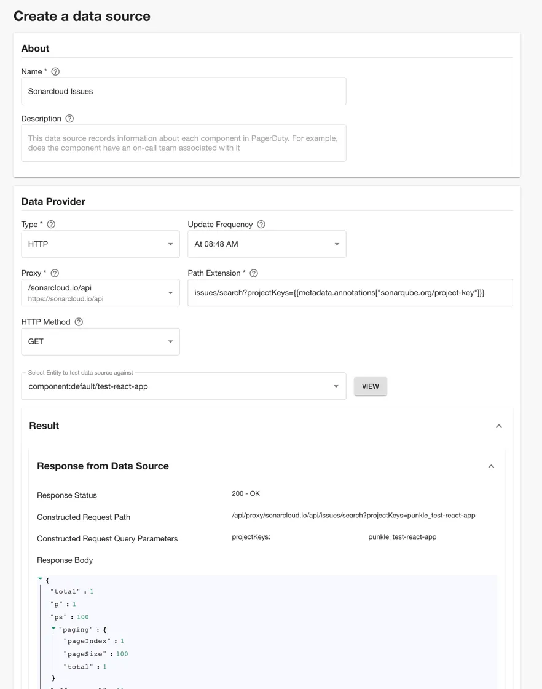
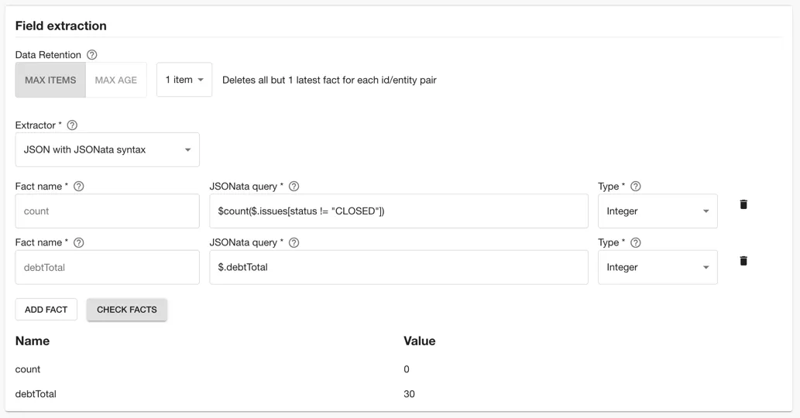
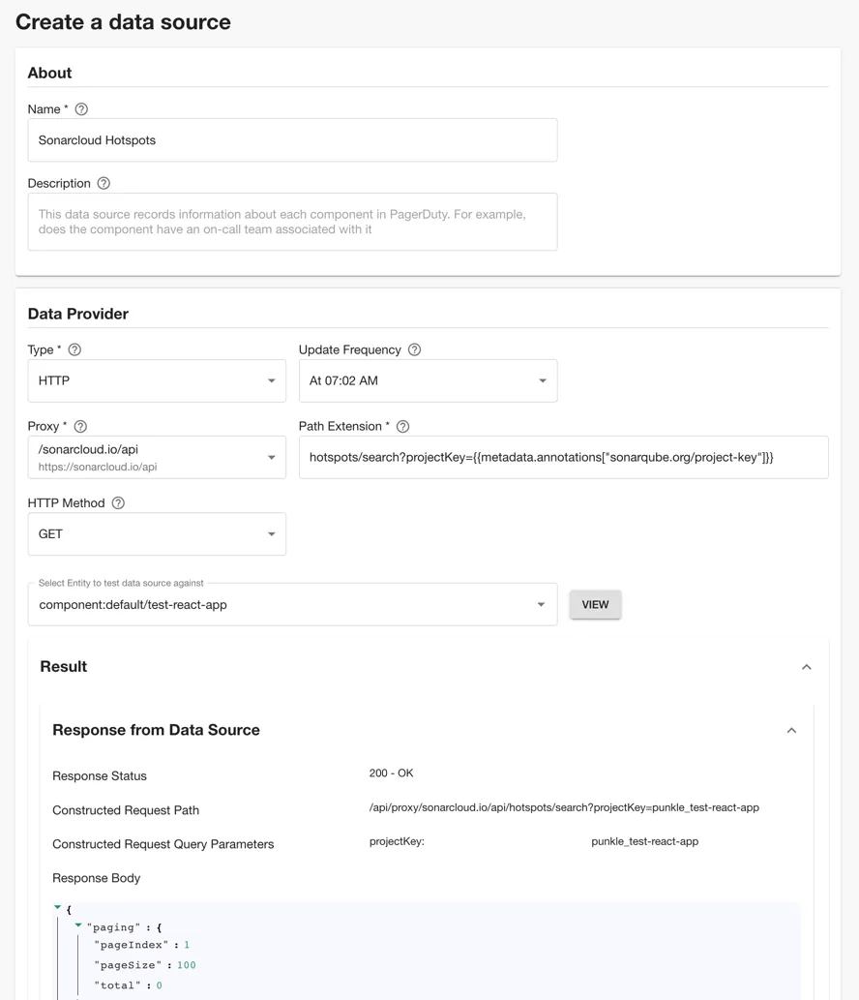
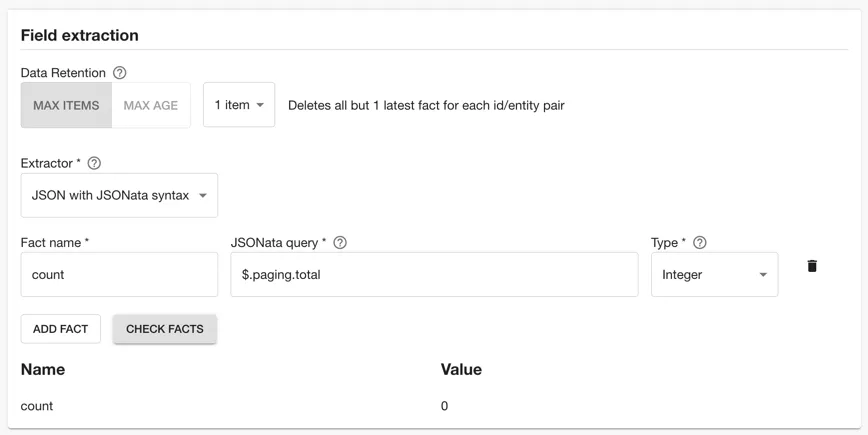
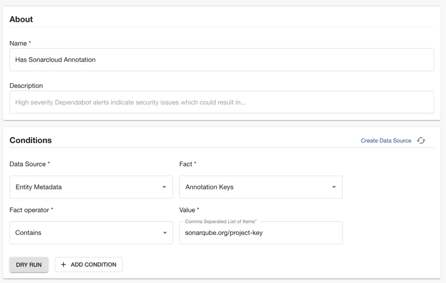
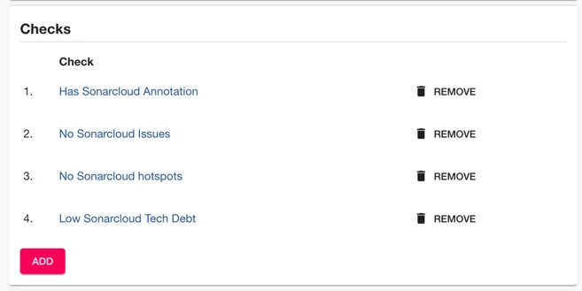
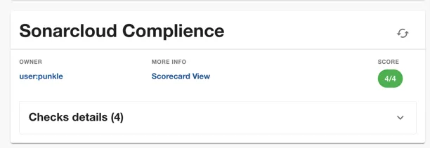

One of the most advantageous steps a platform team can take to support application developers (app devs) is to offer them a reliable and secure platform for enhancing code quality. This is often achieved by incorporating SonarCloud into the development process, enabling teams to identify and rectify code-related issues effectively.

By tracking issues and hotspots reported by Sonarcloud across your organization allows you to highlight and to proactively address potential pitfalls, enhance code integrity, and bolster application security. This practice not only fosters a culture of continuous improvement but also ensures that software projects evolve with a heightened focus on robustness and reliability.

With Roadie’s Tech Insights feature, you can monitor issues and hotspots right within your software catalog:

1. Automatically scan Components in the Backstage catalog and record the number of issues and hotspots reported by Sonarqube
2. Visualise the projects which are doing well, and also the worst offenders.
3. Create a check that can tell us which software is not adhering to standards set by the organization.

As we go through this process, you’ll learn:

1. How to configure a component in Roadie with its Sonarcloud project key
2. How to configure the Sonarcloud API token in Roadie secrets
3. How to configure a proxy in Roadie so that it can communicate with the SonarCloud API
4. How to create an HTTP Datasource to collect data from a REST API
5. How to create a Check with Tech Insights
6. How to create a Scorecard that brings together the Checks with have created in this tutorial

Let’s get started.

## Configure a Component with its Sonarcloud project key

1. First identify the project key for the catalog Component.
   You can find this in the SonarCloud dashboard. Find the project, click Administration -> Update key and copy the "Project Key"
2. Next edit the catalog YAML file for the Component
   The easiest way to do this is to find the component in the Roadie catalog and click the edit pencil in the top right hand side of the About Card.
3. Edit and save the YAML file to include the `sonarqube.org/project-key` annotation.
   e.g.

```yaml
---
apiVersion: backstage.io/v1alpha1
kind: Component
metadata:
  name: test-react-app
  annotations:
    sonarqube.org/project-key: punkle_test-react-app
```

## Configure the SonarCloud API token in Roadie secrets

1. First generate a new token in the SonarCloud dashboard
   Click on your profile in the top right of the application, click My Account. Then click Security. Enter a token name and click "Generate Token". Copy the token value.
2. In Roadie click Administration -> Settings -> Secrets and save the token to the secret named SONARCLOUD_API_TOKEN.

## Configure a proxy in Roadie so that it can communicate with the SonarCloud API

1. In Roadie visit Administration -> Settings -> Proxy and click "Add Proxy"
2. Set the path of the new proxy to `/sonarcloud.io/api`
3. Set the target to `https://sonarcloud.io/api`
4. Expand the advanced section and click "Add" under the Headers section
5. Enter "Authorization" for the header name and "Bearer ${SONARCLOUD_API_TOKEN}" as the header value
6. In the Allow Headers section click "Add Item" and set its value to "Authorization"

## Create an HTTP Data Source to collect issues from Sonarcloud

1. Within Roadie, click on Tech Insights -> Data Sources and click "Add Datasource"
2. Set the name to "Sonarcloud Issues", and set the description if you prefer.
3. Select the HTTP Data Provider, then select the proxy we created earlier.
4. In the Path Extension enter `issues/search?projectKeys={{ metadata.annotations["sonarqube.org/project-key"] }}`
5. Next select an entity that you know has been configured with the Sonarcloud annotation so that we can test the data extraction in the next step.
6. Click view. You should see the HTTP response from SonarCloud with counts of issues like you see below:



7. Next you can select the fields to extract from the API.
   In the Field extraction section select the "JSON with JSONata syntax" extractor. Then enter "count" as the fact name, `$count($.issues[status != "CLOSED"])` as the JSONata query, and select "Integer" type. Add a second fact by clicking "Add Fact", enter "debtTotal", `$.debtTotal` and select "Integer" again.

8. Test the Data Source fact extraction by clicking "Check Facts". You should see something like the following.
   

9. In the Applies to selection, set the "Has Annotation" field to "sonarqube.org/project-key"
10. Click Save.
11. In the Data Source page, click "Actions" and "Run" to trigger an initial run of the Data Source

## Create an HTTP Data Source to collect hotspots from SonarCloud

1. Within Roadie, click on Tech Insights -> Data Sources and click "Add Datasource"
2. Set the name to "Sonarcloud Hotspots", and set the description if you prefer.
3. Select the HTTP Data Provider, then select the proxy we created earlier.
4. In the Path Extension enter `hotspots/search?projectKey={{ metadata.annotations["sonarqube.org/project-key"] }}`
5. Next select an entity that you know has been configured with the SonarCloud annotation so that we can test the data extraction in the next step.
6. Click view. You should see the HTTP response from SonarCloud with counts of issues like you see below:



7. Next you can select the fields to extract from the API.
   In the Field extraction section select the "JSON with JSONata syntax" extractor. Then enter "count" as the fact name, "$.paging.total" as the JSONata query, and select "Integer" type.

8. Test the Data Source fact extraction by clicking "Check Facts". You should see something like the following.
   

9. In the Applies to selection, set the "Has Annotation" field to "sonarqube.org/project-key"
10. Click Save.
11. In the Data Source page, click "Actions" and "Run" to trigger an initial run of the Data Source

## Create checks with the data from the Sonarcloud Data Sources

1. Go to the Checks tab in tech insights and click "Add Check"
2. Enter the name "No Sonarcloud Issues"
3. Select the "Sonarcloud Issues" Data Source and the "count" fact.
4. Select the "Less than" operator and enter the value "1".
5. Click "Dry run"
6. Select the component you configured in the earlier step.
7. You should see it's check result.
8. In the Applies to selection, set the "Has Annotation" field to "sonarqube.org/project-key"
9. Click Save
10. Create two more checks for "Low Sonarcloud Tech Debt" and "No Sonarcloud hotspots"

## Create a Data Source to check the presence of the Entity metadata

1. Go to the Checks tab in tech insights and click "Add Check"
2. Enter the name "Has Sonarcloud Annotation"
3. Select the "Entity Metadata" Data Source and the "Annotation Keys" fact
4. Use the contains operator and "sonarqube.org/project-key" as the value.
   
5. Select the list of "Applies to" filter to match the list of entities you want to comply with your Sonarcloud checks.
6. Click Save and then "Reload Check Data"

## Create a Scorecard to check the quality of your check compliance across your organization

1. In Tech Insights click Scorecards and "Add Scorecard"
2. Name the scorecard "Sonarcloud Compliance"
3. Add all of the checks we created earlier
   
4. In the "Applies to" filter, select the items that you want to comply to this Scorecard
5. Select an owner and optionally an Executive sponsor
6. Click Save.
7. In the Scorecard that appears, click the three dots under "Actions" and click "Refresh Scorecard Results"

## Add the Scorecard to the entity page

1. In Tech Insights, click Scorecards, and click the three dots below "Actions" and click "Add to catalog"
2. Select "Type: service, Layout title: Overview" to add it to the Overview tab for every service in the catalog.
3. Click "Add to entity page"
4. Navigate to the entity we configured with the SonarCloud annotation earlier.
5. You should see a card like the following
   
