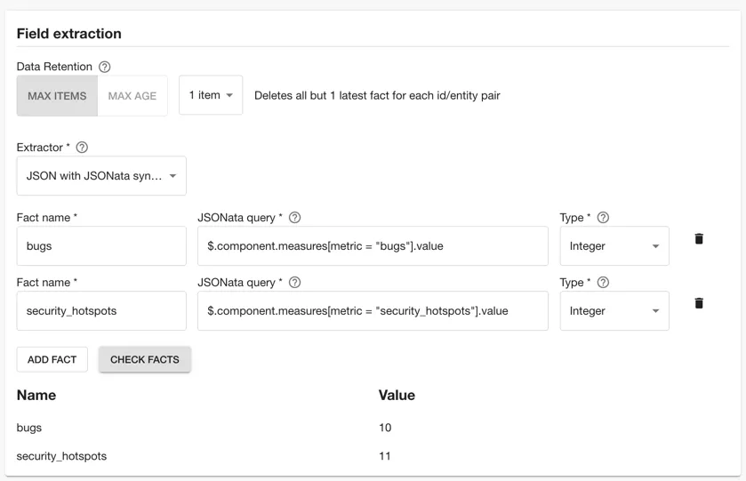

One of the most advantageous steps a platform team can take to support application developers (app devs) is to offer them a reliable and secure platform for enhancing code quality. This is often achieved by incorporating SonarCloud into the development process, enabling teams to identify and rectify code-related issues effectively.

The [Sonarcloud tutorial](/docs/tech-insights/track-sonarcloud/) explains how to configure Roadie to use the publicly accessible API of Sonarcloud. This tutorial instead assumes that you are self-hosting SonarQube and the API is within a private network. In this tutorial we will be using the Roadie broker service to make the connection between SonarQube and Roadie.

By tracking issues and hotspots reported by SonarQube across your organization allows you to highlight and to proactively address potential pitfalls, enhance code integrity, and bolster application security. This practice not only fosters a culture of continuous improvement but also ensures that software projects evolve with a heightened focus on robustness and reliability.

With Roadie’s Tech Insights feature, you can monitor data from services within your private network right within your software catalog:

In this tutorial we will set up Roadie to automatically scan Components in the Backstage catalog and record the number of issues and hotspots reported by SonarQube

As we go through this process, you’ll learn:

1. How to configure a component in Roadie with its SonarQube project key
2. How to configure and run the Roadie SonarQube broker application to connect SonarQube with Roadie
3. How to create an HTTP Datasource to collect data from SonarQube

Let’s get started.

## Configure a Component with its SonarQube project key

1. First identify the project key for the catalog Component.
    You can find this in the SonarQube dashboard. Find the project, click Administration -> Update key and copy the "Project Key"
2. Next edit the catalog YAML file for the Component 
    The easiest way to do this is to find the component in the Roadie catalog and click the edit pencil in the top right hand side of the About Card.
3. Edit and save the YAML file to include the `sonarqube.org/project-key` annotation.

    ```yaml
    ---
    apiVersion: backstage.io/v1alpha1
    kind: Component
    metadata:
      name: test-react-app
      annotations:
        sonarqube.org/project-key: punkle_test-react-app
    ```

## Connect SonarQube with Roadie

To connect SonarQube with Roadie we will use a broker connection. The broker is a Node.js service that you run inside your infrastructure to provide a secure tunnel for Roadie traffic. You can read more about it [here](/docs/integrations/broker/).

1. First generate a new token in the SonarQube dashboard

    Click on your profile in the top right of the application, click My Account. Then click Security. Enter a token name and click "Generate Token". Copy the token value.

2. Run the Roadie broker client application to connect SonarQube with backstage.

    ```shell
    docker run \
      --env SONARQUBE_INSTANCE_URL=https://<sonarqube_address> \
      --env BROKER_TOKEN=sonarqube \
      --env BROKER_SERVER_URL=https://<tenant_name>.broker.roadie.so \
      --env SONARQUBE_TOKEN=<sonarqube_token> \
      roadiehq/broker:5691884253.43.1-sonarqube
    ```

3. Determine the IP address from where the broker client is running and set this IP in the broker allow list in Roadie.
    
    You can determine the IP address locally by running the following command. This command assumes you are running the docker container locally. When you production

    ```bash
    curl 'https://api.ipify.org'
    ```
   
4. To set the IP allow list go to Administration > Settings > Broker enter the IP address and subnet mask using CIDR notation.

5. Confirm that the broker client by looking at the docker container logs. You should see the following text:

    ```text
    successfully established a websocket connection to the broker server
    ```

## Create an HTTP Data Source to collect data from SonarQube

1. Within Roadie, click on Tech Insights -> Data Sources and click "Add Datasource"

2. Set the name to "SonarQube", and set the description "Collects data from our on-prem SonarQube instance".

3. Select the HTTP Data Provider, then select the proxy we created earlier.

4. In the Path Extension enter
    ```
    sonarqube/api/measures/component?component={{metadata.annotations["sonarqube.org/project-key"]}}&metricKeys=bugs,security_rating,duplicated_lines_density,security_hotspots
   ```

5. Next select an entity that you know has been configured with the Sonarcloud annotation so that we can test the data extraction in the next step.

6. Click view. You should see the result of a successful HTTP response from SonarQube.

7. Next you can select the fields to extract from the API.

   In the field extraction box, fill out the inputs with the following values.

   | Fact name         | JSONata Query                                              | Type     |
   |-------------------|------------------------------------------------------------|----------|
   | bugs              | `$.component.measures[metric = "bugs"].value`              | Integer  |
   | security_hotspots | `$.component.measures[metric = "security_hotspots"].value` | Integer  |


8. Test the Data Source fact extraction by clicking "Check Facts". You should see something like the following.
    

9. In the Applies to selection, set the "Has Annotation" field to "sonarqube.org/project-key"

10. Click Save.

11. In the Data Source page, click "Actions" and "Run" to trigger an initial run of the Data Source

## Create checks with the data from the Sonarcloud Data Sources

The process for creating checks and scorecards is very similar to the process for doing the same with SonarCloud. You can find details about how to do that [here](/docs/tech-insights/track-sonarcloud/#create-checks-with-the-data-from-the-sonarcloud-data-sources). 
