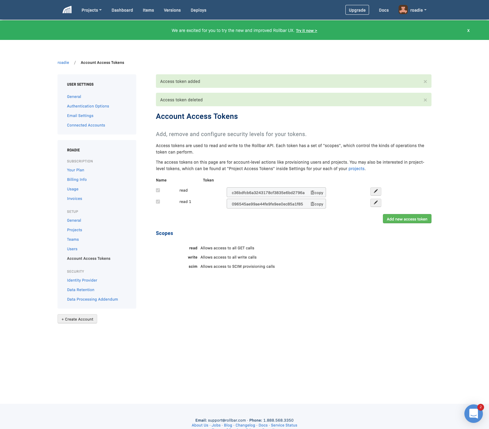

At the time of writing, in July 2020, Rollbar are rolling out a new UI which doesn't seem to
have the ability to create API keys.

To switch back to the old UI temporarily, click your organization's name in the bottom left
corner and select "Switch to old UI".

Once there, go to your Account settings and click Account access tokens in the sidebar. Here
you can "Add new access token". Make sure it has the `read` scope.

