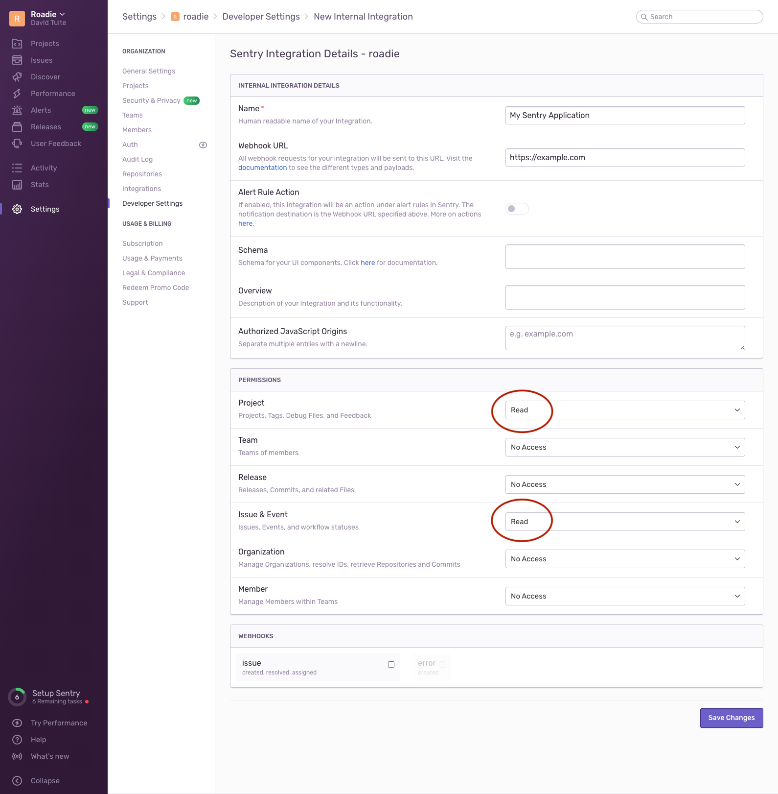

The Backstage backend must have access to a `SENTRY_TOKEN` API key environment variable.

To get an API key, first create an internal application in the Sentry UI. Do this at the
organization level, rather than the personal level.

Give your application a name and a Webhook URL, then be sure to give the ability to read
issues and projects. These will be displayed in Backstage so it's important that the plugin
can access them.



Once you have an internal application, you can create a token. Run the Backstage backend with
this token.

```bash
env SENTRY_TOKEN=123abc yarn start
```
