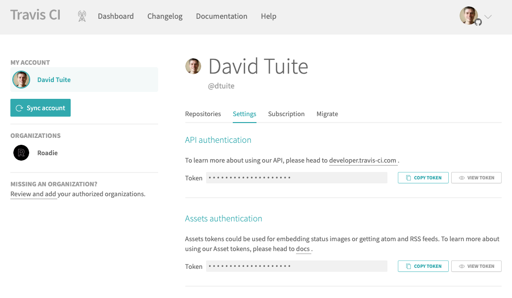

## Features

- List Travis CI Builds
- Retrigger builds

To use the Travis CI Backstage plugin, first visit Travis CI to get an API token: https://travis-ci.com/account/preferences

There are two versions of Travis CI: https://travis-ci.com and https://travis-ci.org. travis-ci.org is deprecated and not supported in this plugin.

Copy the token to your clipboard.

Each build can be retried via the column on the right hand side.
