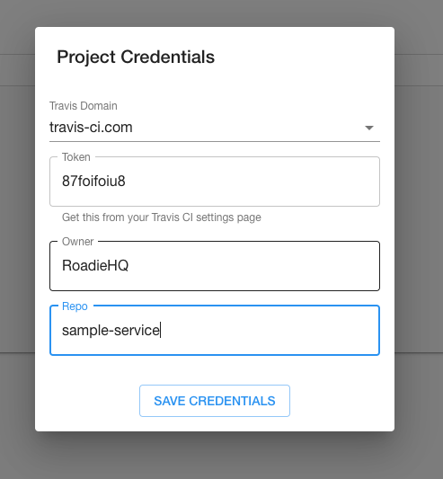
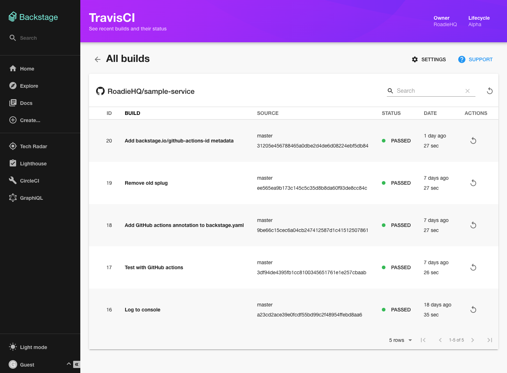

To use the Travis CI Backstage plugin, first visit Travis CI to get an API token.

There are two versions of Travis CI: https://travis-ci.com and https://travis-ci.org. Tokens
from .com do not work for .org and vice versa, so make sure you are on the right Travis website.

Tokens can be copied from the settings page in Travis CI. Use the menu in the top right of the page to navigate to Settings. Click Settings again, under your name this time, and you should see API authentication.

Copy the token to your clipboard.

Next, open the settings dialog in the Travis CI Backstage plugin by clicking the Settings button in the top right of the plugin.

Select the version of Travis CI that you use, .com or .org, paste the API token into the Token input, then set the owner and repo of the project you wish to view builds for. For example, `spotify/backstage` has the name `backstage` and owner `spotify`.

Hit Save Credentials and your builds should load.

Each build can be retried via the column on the right hand side.
