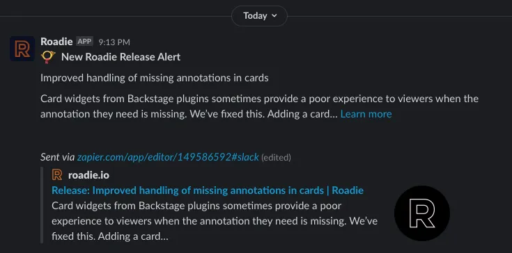
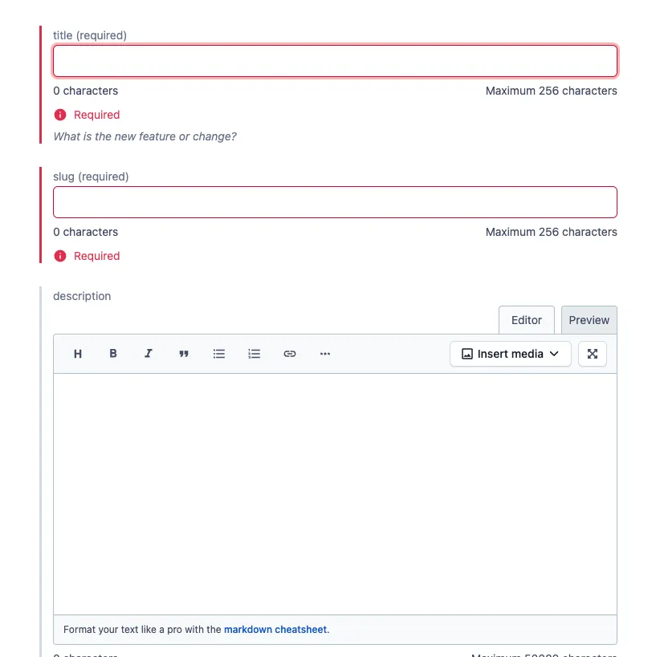

# Changelog

The changelog is a list of customer facing changes which we have rolled out on Roadie. It is
a way for people to find out what features or bug fixes have been released recently.

The changelog can be found at: https://roadie.io/changelog/

The content of the changelog lives in [Contentful](https://app.contentful.com/spaces/hcqpbvoqhwhm/home).

## RSS

The changelog has an RSS feed which can be found at https://roadie.io/changelog/rss.xml

## Notifications to customer slack channels

New updates to the changelog are automatically posted to the shared Slack channels
that we use to communicate with our customers and free trials.

These automatic updates look like this:

These Slack messages are posted by Zapier tasks which watch the RSS feed and send Slack messages
when a change is found.

There must be one Zapier job per Slack channel unfortunately. This is a bit unwieldy since we
maintain many Slack channels with prospects and customers. We can add some automation
in this area in future.

For now, when creating a shared Slack channel with a customer or prospect, please remember to
also create a Zapier job to ensure it gets product updates. The easiest thing to do is to
simply duplicate one of the existing tasks and change the name and Slack channel targeted.

The Zapier tasks can be found in [the Changelog Updates folder](https://zapier.com/app/zaps/folder/1198706).

## Updating the changelog

To create a new changelog item (called a ChangeSet), fill out the form on Contentful with the
required attributes.

Once published, the RSS feed will update and the notifications will send into Customer channels,
so make sure you have reviewed your text carefully before hitting the Publish button.

Draft change sets can be previewed at https://preview.roadie.io/changelog/. The password required
to access that page is in the shared 1password vault.
