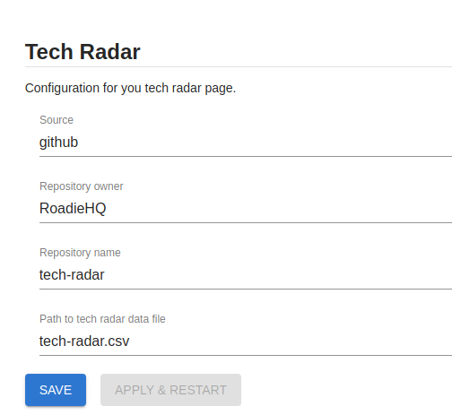

## Introduction

If you want to use Tech Radar on your Roadie instance you can add it as a page using the steps defined in [this guide](../../getting-started/updating-the-ui#updating-the-sidebar).


## Configuration

The configuration for Tech Radar data can be defined at the following url:
```text
https://<tenant-name>.roadie.so/administration/settings/tech-radar
```



Roadie currently supports fetching tech radar data directly from GitHub. In the configuration you need to tell your Roadie instance the repository name, organization/user and path to the actual tech radar data file within the repository. Both CSV and JSON data files are supported, as long as they conform to the specified format. 


## Data formats

Roadie Tech Radar supports two different data types, JSON and CSV. JSON gives user more control over the specified radar configuration. CSV provides a somewhat simpler but more restricted option.
Tech radar has the following terminology:

* Entries: Technologies you wish to place on your radar
* Quadrants: Broad catagories that entries fit into e.g. Languages, Platforms, Techniques, Tools.
* Rings: Represent a scale by which you compare entries. E.g. Adopt, Trial, Assess, Hold


#### Valid values

Both JSON and CSV format use similar set of values. Mandatory values and their types are as follows:
```
title: text to display as the entry title
quadrant: reference to quadrant id
ringId/ring: reference to ring id. ringId is used for JSON format, ring for CSV
```

For more information you can also define more descriptive, optional values:


```
description: longer description text for the entry
url: link for more information about the entry
moved: number, where negative value indicates movement down in the radar, 0 indicates that the entry has not moved, and a positive value indicates movement upwards in the radar.
```

### JSON

With JSON format you can set up Tech Radar rings and quadrants as well as the data. An example JSON file would look like this:

```json
{
  "rings": [
    {
      "id": "use",
      "name": "USE",
      "color": "#93c47d"
    }
  ],
  "quadrants": [
    {
      "id": "languages",
      "name": "Languages"
    }
  ],
  "entries": [
    {
      "timeline": [
        {
          "moved": 0,
          "ringId": "use",
          "date": "2020-08-06T00:00:00.000Z",
          "description": "Lorem ipsum dolor sit amet, consectetur adipiscing elit, sed do eiusmod tempor incididunt ut labore et dolore magna aliqua"
        }
      ],
      "url": "#",
      "key": "javascript",
      "id": "javascript",
      "title": "JavaScript",
      "quadrant": "languages"
    }
  ]
}
```

In the rings section you can define names for rings in the tech radar and their corresponding colors. For quadrants naming of them is modifiable. Note that both rings and quadrants contain an `id` field which should be matched in the entries themselves to get them positioned in the correct location within the tech radar.    

In the entries section an individual entry should contain values for `title`, `quadrant` and `timeline`. Timeline should contain at least one object itself that should have values for `moved` and `ringId`. Additionally you can define `description` and `url` for the entry which would be displayed as a pop-up info box when the entry is clicked in the tech radar user interface.   

The order of `rings` and `quadrants` define their position on the tech radar.


### CSV

With CSV format you can define your tech radar as a comma separated file. The order of appearance for rings and quadrants define the order they are displayed on the radar. The colors for rings in the radar are defined and can be modified using CSV format. 

An example CSV file would look like this:
```csv
title,ring,quadrant,moved,description,url
Managed Backstage,use,infrastructure,1,"Zero config approach to Backstage developer portal",https://roadie.io
React,assess,frameworks,-1,"A JavaScript library for building user interfaces",https://reactjs.org/
TypeScript,trial,languages,0,"TypeScript is JavaScript with syntax for types.",https://www.typescriptlang.org/
Scrum,hold,processes,-1,"Framework utilizing an agile mindset for developing, delivering, and sustaining products",https://www.scrum.org/
```

With this example file the tech radar will be constructed to have rings `use`, `assess`, `trial` and `hold`. Quadrants will be `infrastructure`, `frameworks`, `languages` and `processes`.


## More information

[Backstage Tech Radar plugin documentation](https://github.com/backstage/backstage/blob/master/plugins/tech-radar/README.md)
