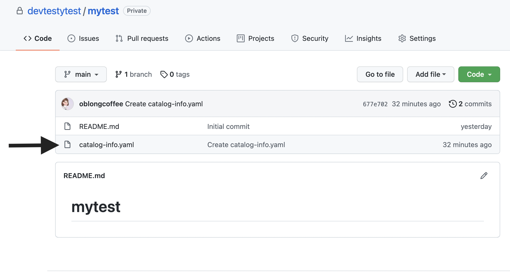
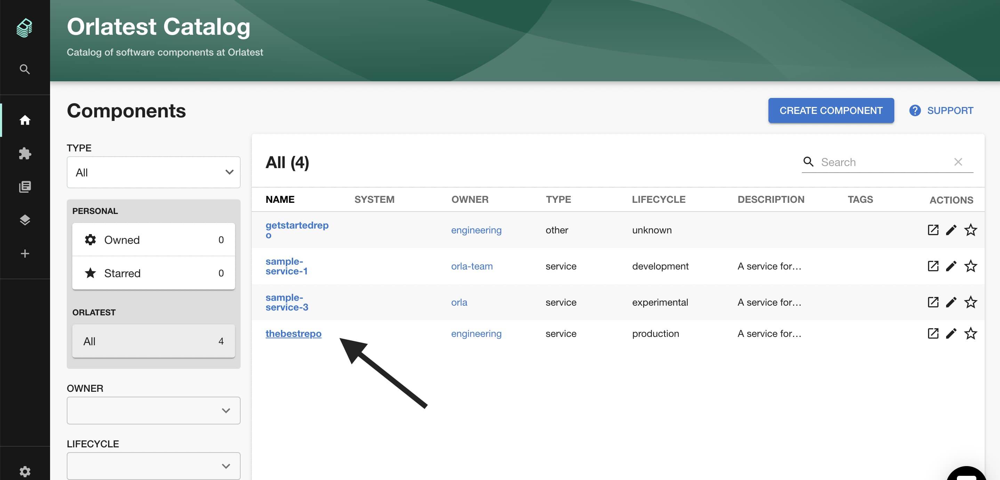

## Introduction

This tutorial will show you how to add components such as services or websites to the Backstage catalog.

## Prerequisite 
You must have installed the Github App in order to import components in private repositories. If you have not done this you can find the steps to do this [here.](../../getting-started/getting-started-for-admins/#connect-roadie-to-github). Components in public repositories can be added without installing the GitHub app.

## Steps

### Step One. Create your 'catalog-info.yaml' file
Each component that Backstage tracks must be represented by a YAML file which describes it. 

**Important**
- This YAML file must be called 'catalog-info.yaml'
- This file must be located in the main branch of the repo of the component that you want to import into Backstage.



The basic structure that you should use for your YAML files looks like this:

```yaml
apiVersion: backstage.io/v1alpha1
kind: Component
metadata:
  name: sample-service-1
  description: |
    A service for testing Backstage functionality. Configured for
    GitHub Actions.
  annotations:
    github.com/project-slug: roadiehq/sample-service
spec:
  type: service
  owner: my-team-name
  lifecycle: production
```

**Best Practice Tip!** </br>
Ensure the name of the component will make sense to you and your team. This is how other users will refer to your component in Backstage.

### Step Two. Import Your Component YAML file into Backstage
Backstage scans your Github Org for new updates periodically, discovers YAML files and adds components automatically. Once you have added a YAML file to any repo that you want to be imported to Backstage it will be found and autopopulated as a component.

If you don't want to wait for a component to be discovered you can add components manually to Backstage by using the catalog importer available at `/catalog-import`. You can do this by copying and pasting the URL of the YAML file into the importer (see video below). If you are just getting started with Backstage we recommend adding your first few files manually as it will get you going quicker. 


[](https://www.loom.com/share/b96f07f0579a423f8cb762e8c1b7f3fe "Adding a Component")

### Step 3. View your Component
Click the Home link in the Backstage sidebar to go back to the catalog where you should see your component. Depending on the type of component you imported, you might have to cycle through the tabs until you see your component.



## TroubleShooting FAQs
**Component Not Appearing?** </br>
If your component is not appearing make sure Backstage has permissions to read the repo that you added the yaml file to.
You can check this by going to the Github settings of a repo that Backstage already has access to, then follow `Settings>Integrations>Configure`, and making sure your repo is listed in the allowed repos:


## What Next? 

Let's [add some documentation for the component we just created](../../getting-started/technical-documentation/) so that others in your organization can easily learn how to use it.
