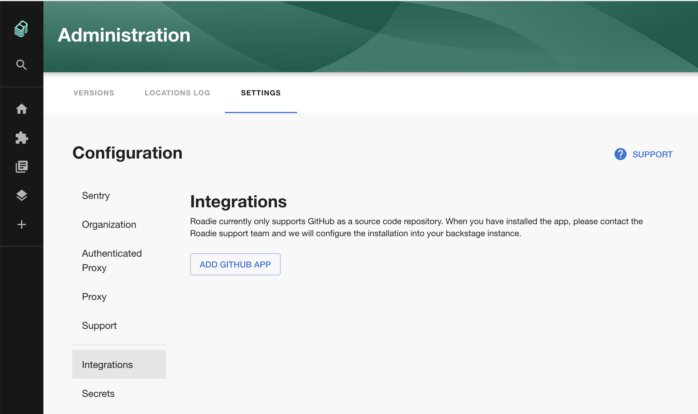
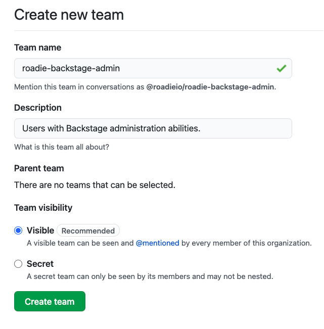
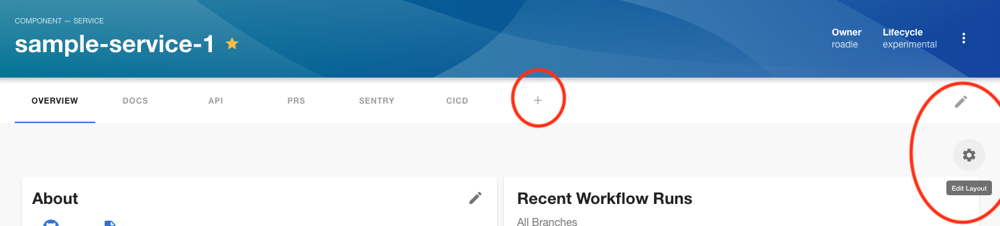

## Introduction

This tutorial will guide you through the steps required to set Roadie up for basic use within your organization. Once completed, you will:

 1. Be an admin user of Roadie.
 2. Have connected Roadie to your organization's GitHub account.

There are 3 kinds of Backstage resource used in this tutorial.

1. The `User` entity represents an employee at your company.
2. The `Group` entity represents a team or larger organizational structure.
3. The `Component` entity represents a piece of software like a website or backend service.

## Prerequisites

In order to complete this guide, you will need the following things:

1. Access to a Roadie account. If you do not yet have access, please [request a free trial](https://roadie.io/free-trial/).
2. A GitHub Cloud or GitHub Enterprise Cloud account.
3. A test service on GitHub which you can make changes to.

## Connect Roadie to GitHub

Roadie needs to connect to GitHub in order to function. This can be setup by installing the Roadie GitHub App.
Installing the GitHub App will allow Roadie to:

1.  Access the YAML metadata files that Backstage needs to operate.
2.  Read your GitHub organisation's users and team structure into backstage.  
3.  Make requests from the browser on your behalf e.g. listing open pull requests.

You can find a link to install the GitHub app in the Backstage application:

1. Click the Administration link in the bottom left
2. Click the Settings tab along the top of the Administration page and then the Integrations link
3. Click on the link to install the GitHub app.
4. Follow the steps to install the App
5. You may need to wait up to 2 minutes for the GitHub integration to become active

ℹ️  &nbsp;If you are not an owner of your GitHub organization, you will need to ask an owner to approve the App installation and then contact us to enable the App.

## Add an admin group and user

Roadie admins have special powers such as the ability to add and remove Backstage plugins. We will use GitHub teams to create an admin group for Roadie.

ℹ️  &nbsp;Admin groups are **not** a security measure. They hide certain UX features from regular users in order to simplify the experience. Backstage does not currently support role based access control (RBAC).

### Step 1. Create an admin group on GitHub teams

Visit GitHub Teams in your organization's GitHub account and click the New Team button.

Set the Team name to `roadie-backstage-admin`. This is a special value and must be an exact match.

Enter a Description such as "Users with Backstage administration abilities.".

Leave Parent team unselected and click the Create team button.

By default, GitHub adds your account to the team as a member. You are now an admin on Roadie and should have access to two main features:

1. Access to the Secrets panel via the "Administration" link in the sidebar.
2. The ability to add and remove plugin cards and tabs (see red-circled icons).

ℹ️  &nbsp;It can take some time for Roadie to refresh the list of teams from GitHub teams. If you do not see admin functions immediately, please wait a few minutes and try again.

### Required GitHub App permissions
The Roadie GitHub app requires both read and write access to GitHub in order to support the normal features of Backstage. You can also choose to allow access to all repos, or select the repos that you would like to give permission to.

These are the repository permissions required:

| Name              | Access level | Reason required |
| ----------------- | ------------ | ------- |
| Administrator     | Read & Write | Allows the scaffolder feature to create new projects in GitHub |
| Contents          | Read & Write | Used by Backstage to read the `catalog-info.yaml` files it requires to function, and to open pull requests to create `catalog-info.yaml` files. |
| Pull requests     | Read & Write | Required for the GitHub Pull Requests plugin and to open pull requests to create `catalog-info.yaml` files. |
| Actions           | Read         | Enables the Backstage plugin that renders Github workflow actions on the component page. |
| Metadata          | Read         | This gives Roadie read only access to various pieces of metadata about the  GitHub organisation used only in order to enable functionality. This permission is mandatory for all GitHub apps. |
| Security events   | Read         | This allows Backstage to render a security insights plugin on the component page. |
| Dependabot alerts | Read         | Required by the GitHub Dependabot plugin. |
| Workflows         | Read & Write | Allows the scaffolder feature to create workflows for new projects it creates in GitHub |
| Checks            | Read & Write | Allows the Github app to run checks on your backstage repositories |
| Projects          | Read         | Allows the Github app to run checks on your backstage repositories |

These are the organization permissions required:

| Name              | Access level | Reason required |
| ----------------- | ------------ | ------- |
| Members           | Read         | This allows Backstage to authenticate users of your Github org and ensure only users of your organisation can access it. It also allows for ownership to be assigned and displayed for each service. |
| Administration    | Read & Write | Allows the scaffolder feature to create new projects in GitHub |

## Next steps

Let's [add a component to Backstage](../../getting-started/adding-components/).

Also you can [add another user to Backstage](../../getting-started/user-management/).
