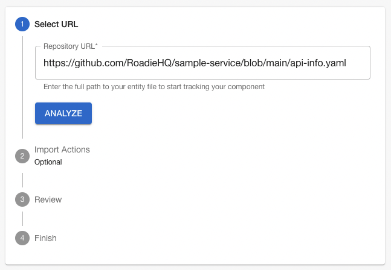
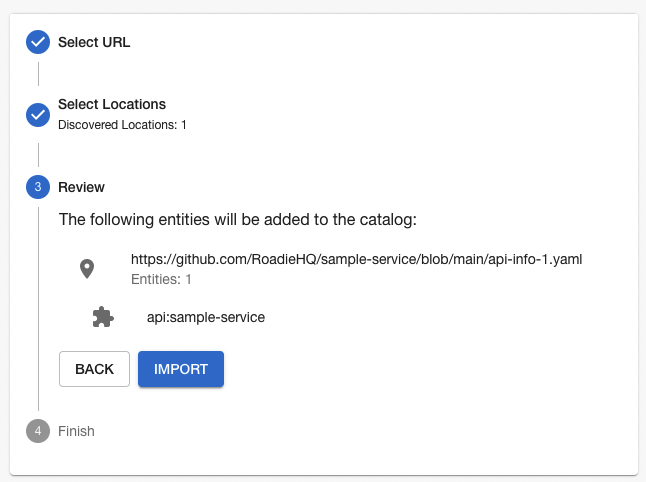
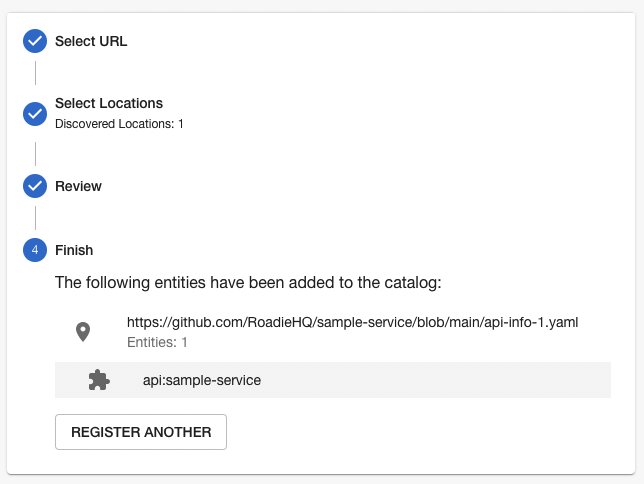
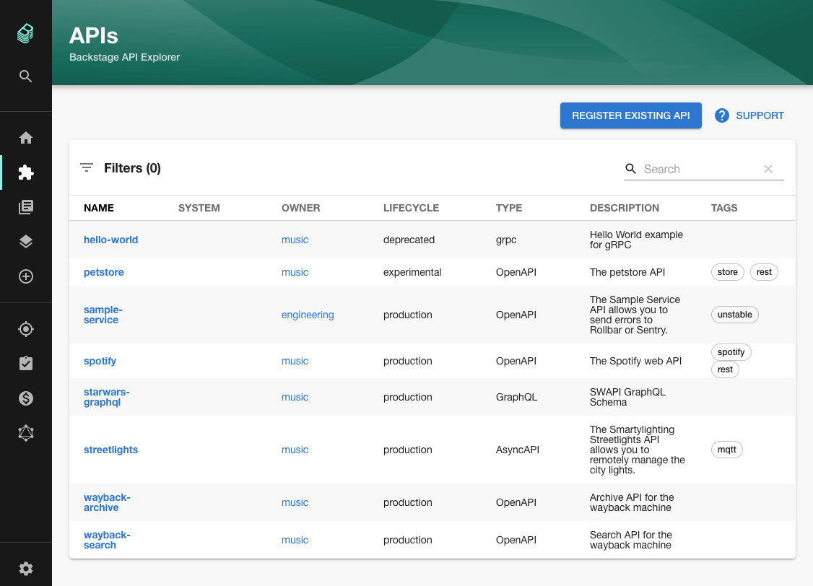
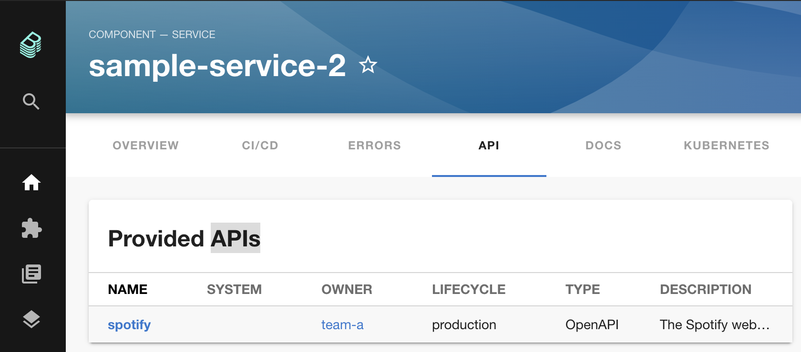
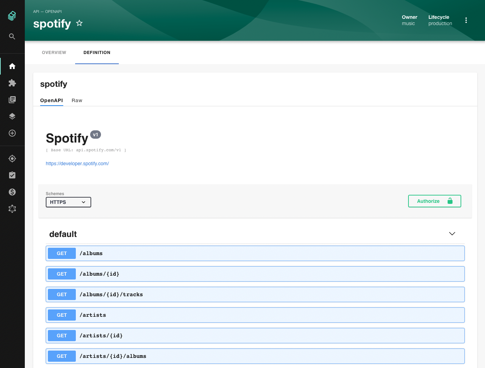

## Introduction

The Open API spec support of Backstage allows users to look up and read the OpenAPI specs of services in the catalog.

Creating Open API specs is outside the scope of this documentation. Please see the [Swagger OpenAPI Getting Started Guide](https://swagger.io/tools/open-source/getting-started/) for more information on writing OpenAPI specs.

## Pre-requisites

Before starting this guide, please...

1.  Prepare an OpenAPI spec to use. Alternatively, you can use one of the [APIs listed on APIs Guru](https://apis.guru/browse-apis/). In the examples below, we will use the [Spotify API Spec](https://api.apis.guru/v2/specs/spotify.com/v1/swagger.yaml).
2.  Understand how entities are added to Backstage via YAML definitions. Please read the [Adding Components Guide](../../getting-started/adding-components/) to learn more.
3.  Track a component in Backstage so we can add an API spec to it.

## Adding an OpenAPI spec to a component

### Step 1: Create an API kind

Create a YAML file called `api-info.yaml` in the root of your component, alongside your code. This file will represent your API inside Backstage.

```yaml
apiVersion: backstage.io/v1alpha1
kind: API
metadata:
  name: spotify
  description: The official Spotify REST API
spec:
  type: openapi
  lifecycle: production
  owner: spotify
  definition:
    $text: https://api.apis.guru/v2/specs/spotify.com/v1/swagger.yaml
```

The `API` kind can take many of the normal `spec` properties such as `owner` and `lifecycle`.

The `spec.definition.$text` property **must** point to the remote URL of your OpenAPI spec.

### Step 2: Add the API to Backstage

Once this YAML file is committed and available on GitHub, you can make Roadie Backstage aware of it using the catalog importer.

Copy the URL of the YAML spec on GitHub, paste it into the catalog importer at `https://your-company.roadie.so/catalog-import` and click Analyze.



Review the action the importer is going to take, then press Import.



Click the name of the API to view it in Backstage.



You should also be able to view your API in the list of APIs Backstage tracks by clicking the "APIs" item in the sidebar or visiting `/api-docs`.



### Step 3: Link the API to a component

Now that the API is tracked in Backstage, we can associate it with a component.

In the `catalog-info.yaml` file of a component, add the `spec.providesApis` property to
indicate that this component provides the `spotify` API.

```yaml
apiVersion: backstage.io/v1alpha1
kind: Component
metadata:
  name: sample-service-2
  # Other metadata and annotations omitted for brevity.
spec:
  type: service
  owner: my-team
  lifecycle: experimental
  providesApis:
    - spotify
```

The token `spotify` under `spec.providesAPIs` **must** match the `metadata.name` of the `API` we created earlier.

A single component can provide multiple APIs.

Once this step is done correctly, we can visit the API tab of our component in Backstage to see that it provides the Spotify API.



And we can click through to the definition of that API to see the specification.



## Further reading

1. The [official Kind: API documentation](https://backstage.io/docs/features/software-catalog/descriptor-format#kind-api).
