## Introduction

Roadie allows you to configure which plugins you want to use via our UI. This guide explains the different types of
plugin components and the different places they can be integrated into the app.

## Prerequisites

You must be an admin to edit the UI layout. Please complete [this guide](../../getting-started/getting-started-for-admins/) before moving on to this one.

## About Plugins

Backstage is a plugin based application where each plugin provides a certain piece of functionality. A plugin may
integrate with some external system such as GitHub to display information for a certain Entity e.g. Show pull request
information for a particular service. 

You can read more about Backstage plugins [here](https://backstage.io/docs/plugins/).

Backstage plugins can provide [three different types](https://backstage.io/docs/plugins/composability#naming-patterns) of UI elements:
1. Card - These are tiles which can be arranged into dashboards in the software catalog. E.g. The About card.
2. Content - These are tabs which can be integrated with the catalog. E.g. The TechDocs tab.
3. Page - These are top-level pages in Backstage, outside of the catalog. Accessible via links in the sidebar. E.g. The catalog itself is a Page.

## Updating the Catalog Layout

Admin users can add components to catalog pages to configure what is displayed to users when they view an entity. Layouts are configured
per entity **kind** except for Component entities which have layouts per **type**. For example, "User" and "Group" are each kinds
of entity and so User entities have a different layout to Group entities. Similarly, Component entities have types such
as "Service", "Library", "Website", etc and different types can have different layouts. However, a particular entity can't
have its own layout; A particular Group or service can't have a unique layout. This is to encourage a consistent UX.

### Updating Tabs

To add a tab click the plus icon at the end of the tab list.

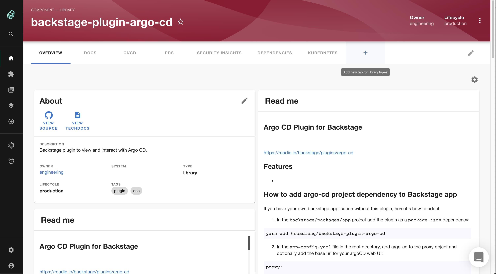

Then select the component to add via the autocomplete and give the tab a display name and click "Create".

NB: When choosing a name please make sure it starts with something unique. (There is currently a
[bug in opensource backstage](https://github.com/backstage/backstage/issues/7741) which means that if you create a new
component that shares the same initial name as an existing one (i.e. `Api` and `Api Visualiser`), you will not be able 
to select the new component.)

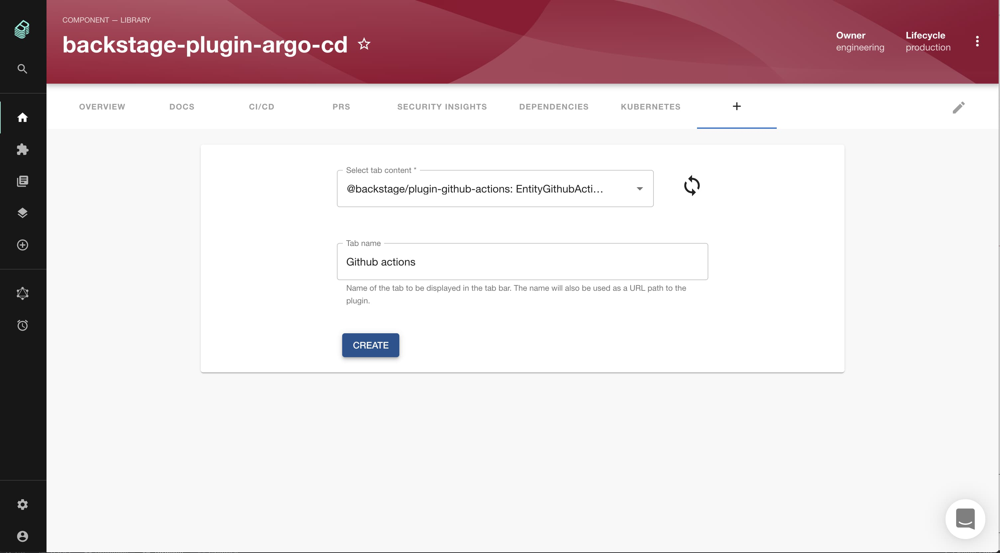

To rearrange or delete tabs select the "pencil" edit icon on the far right of the tab bar.

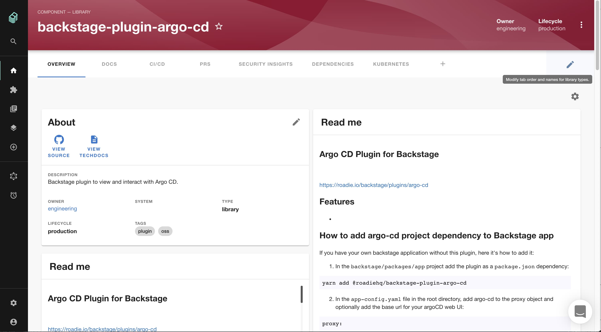

Then drag and drop to rearrange or click the "x" icon to remove a tab then *click the save icon* on the right hand side.

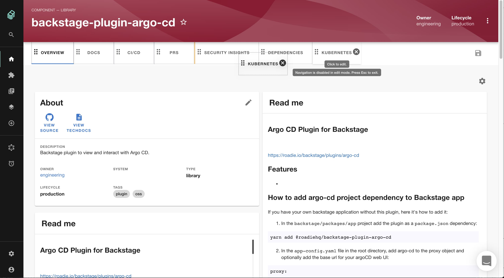

### Updating Dashboards

To edit a dashboard click the cog icon on the top right of the dashboard below the tab bar.

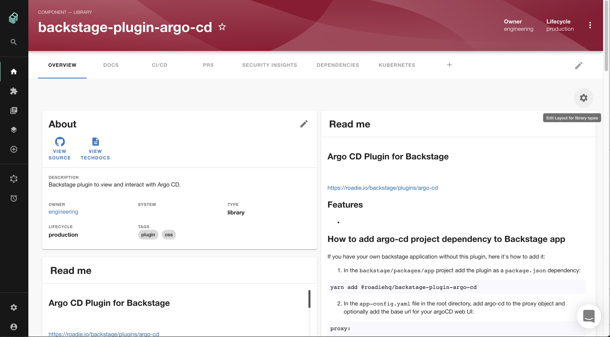

This will switch the dashboard into an edit view. You can drag and drop to rearrange or click the dustbin icon to remove a card. 

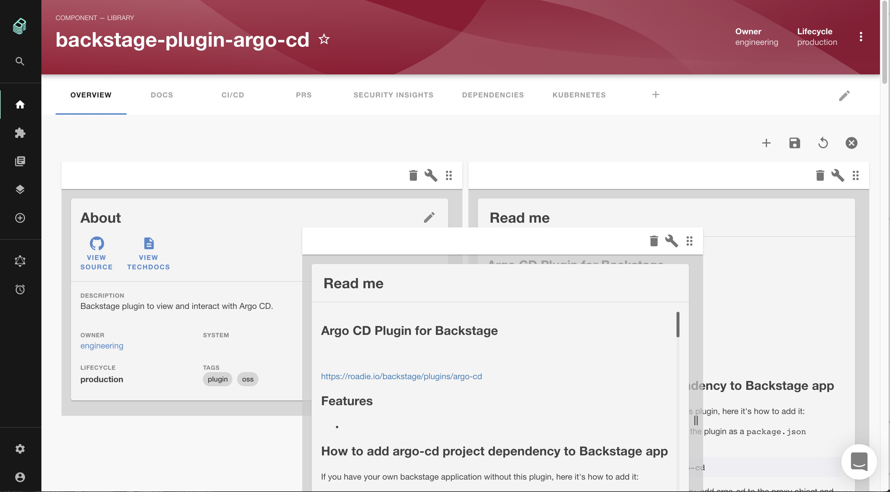

To add a card click the plus icon in the menu on the top right of the dashboard.

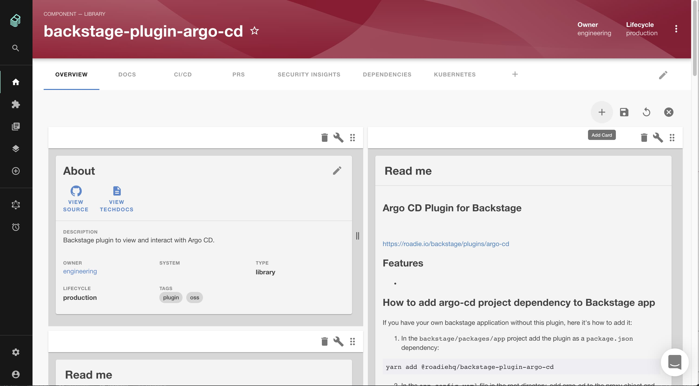

Then select the card to add and click "Add".

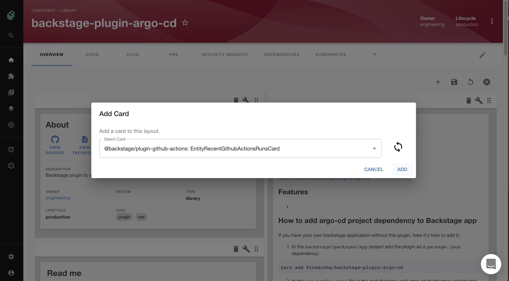

You can adjust the position of the new card as above. When you're finished don't forget to save your changes!

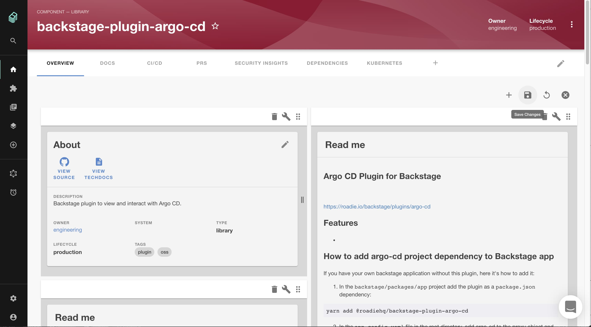

Entities will have one "Overview" dashboard by default but you can add others. Simply create a tab selecting "Dashboard" as the component to add. 

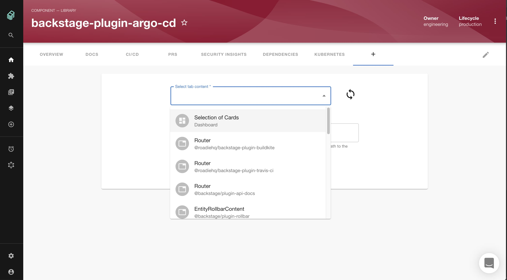

### Updating the Sidebar

Page components are displayed in the sidebar. To edit the sidebar click the "Edit Sidebar" icon.

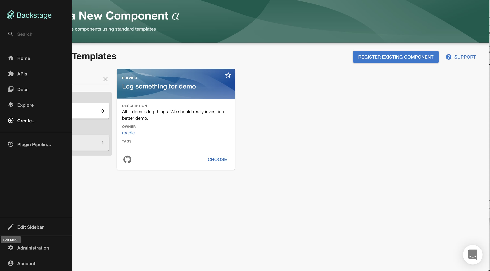

You can then drag and drop to rearrange or click the "x" icon to delete.

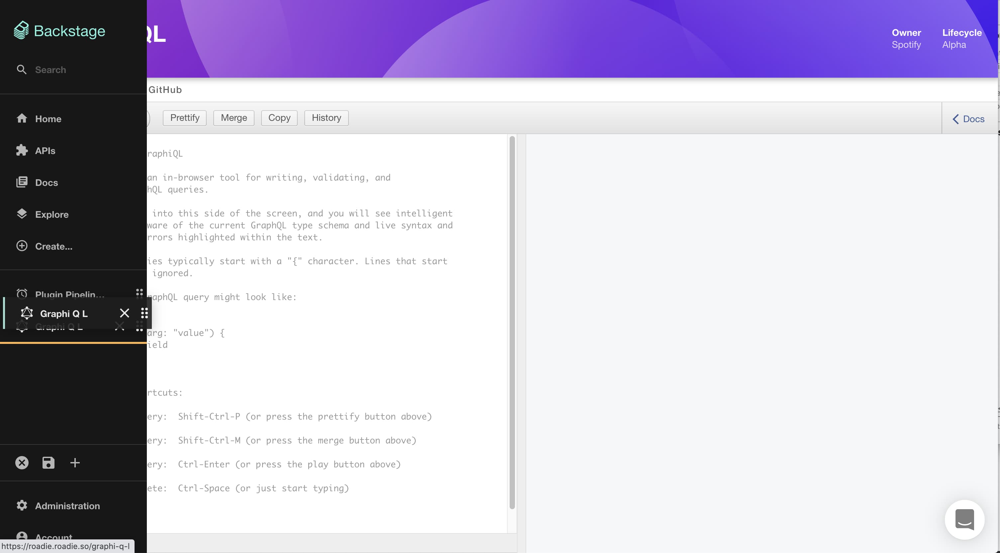

To add a page click the "Add Page" icon.

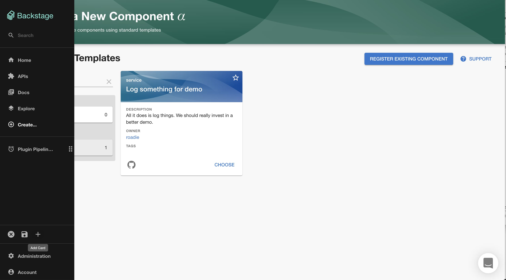

Then select the component in the autocomplete and adjust the title and path as necessary and click "Add".

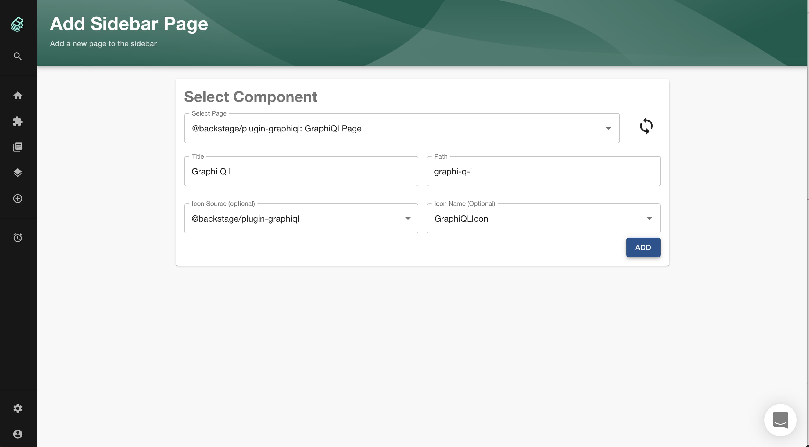

Finally, don't forget to save your changes.

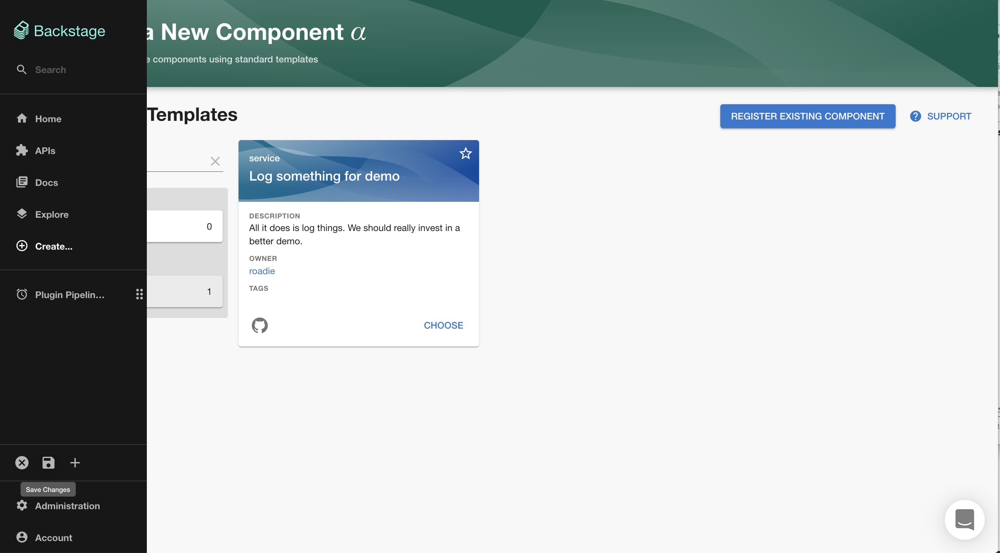

