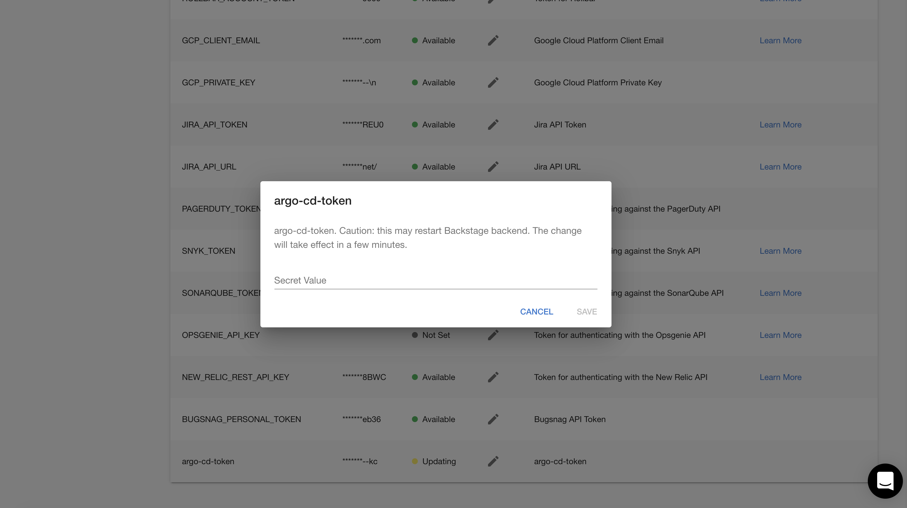
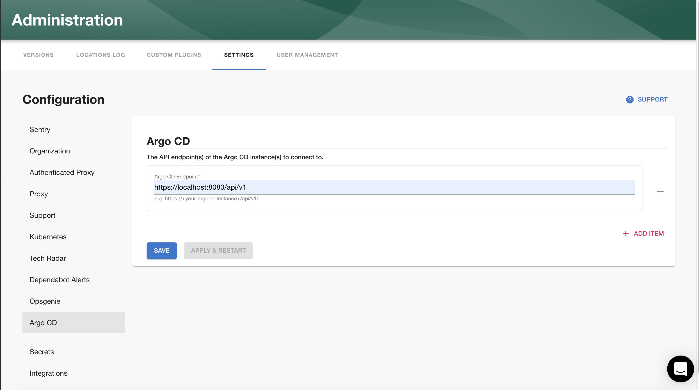
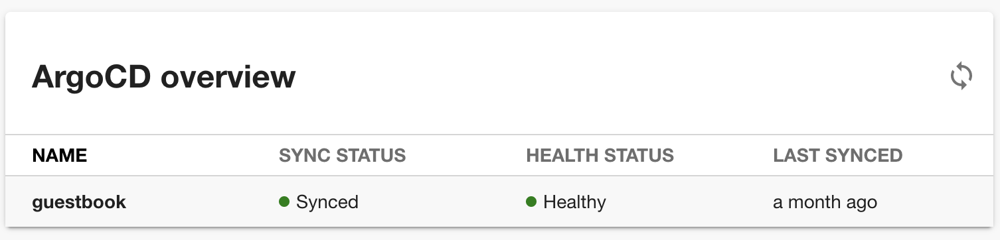
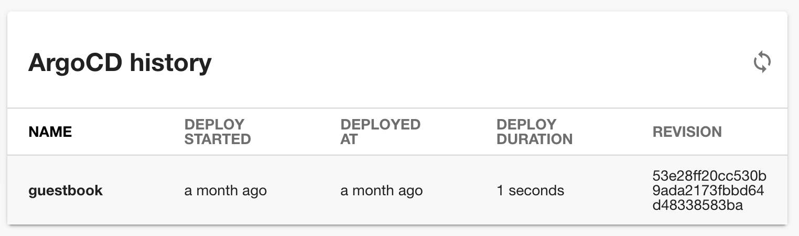
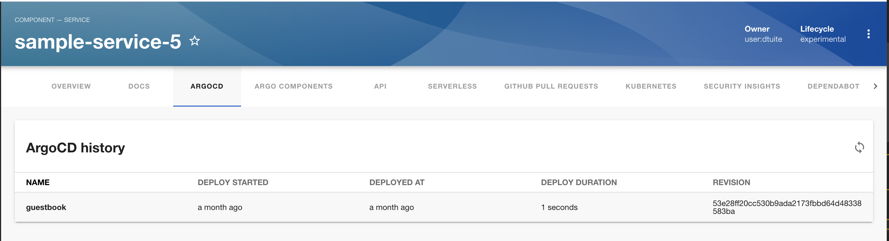

## Introduction

This page describes how to set up the ArgoCD plugin.

## Steps

### Step 1: Create an API token

In order for the Backstage integration to work we must first generate our api key.

You can generate a key via the ArgoCD CLI or UI. 

Via the CLI run:

```argocd account generate-token --account <your-account> --id <optional-id>```

Alternatively, via the UI at `/settings/accounts/<your-account>` click "Generate New" in the "Tokens" section.

### Step 2: Store the credentials in Roadie

Visit `https://<tenant-name>.roadie.so/administration/settings/secrets` and enter the key into the `argo-cd-token` secret.



### Step 3: Configure Roadie with your ArgoCD account details

Visit `https://<tenant-name>.roadie.so/administration/settings/argo-CD` and enter your ArgoCD server API endpoint click
"Save" then "Apply & Restart".



### Step 4: Add the UI elements

The ArgoCD plugin provides two type of UI elements. 

The `EntityArgoCDOverviewCard` presents the current status of an application: 



The `EntityArgoCDHistoryCard` displays the deployment history of an appliction:



Both can be [added to component dashboards](../../getting-started/updating-the-ui/#updating-dashboards).

The `EntityArgoCDContent` displays similar information to the history card and can be [added as a tab](../../getting-started/updating-the-ui#updating-tabs) to component layouts.



## Multiple ArgoCD Instances

If you require integrating with multiple ArgoCD servers contact Roadie and we will enable this for you.

## References

- [argo_cd backstage plugin](https://github.com/RoadieHQ/roadie-backstage-plugins/tree/main/plugins/backstage-plugin-argo-cd)
