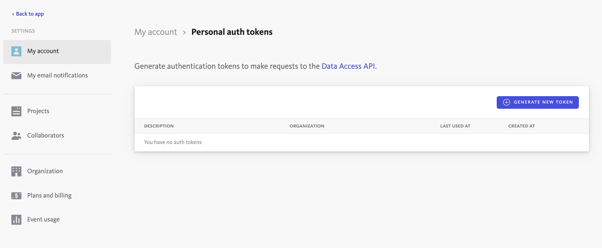

## Introduction

In order to use the Bugsnag plugin, Roadie needs an API token to communicate with Bugsnag APIs.


This is set within backstage at the following url:

```text
https://<tenant-name>.roadie.so/administration/settings/secrets
```

This page describes how to create and set up the Busnag Personal Access (API) token.

## Steps

### Step 1: Create an API token

Start by visiting the account settings page in Bugsnag : https://app.bugsnag.com/settings/{organizationaname}/my-account/auth-tokens.

Click on the "Generate new token" button.

   

On the modal window you can give the token a description so you can recognize it later, e.g. "Roadie Backstage" and finally Bugsnag will show you the API token once. Make note of this token, you will only be able to see it once.

### Step 2: Store the token in Roadie

Visit `https://<tenant-name>.roadie.so/administration/settings/secrets` and enter the token value from above into `BUGSNAG_PERSONAL_TOKEN`.

### Step 3: Add the annotation to each Backstage Component

Add the following annotation to each Backstage Component

```
bugsnag.com/project-key: <organization-name>/<project-notifier-api-key>
```

Both values can be found in the Bugsnag settings dashboard, under organization and project settings.

⚠️  The `<organization-name>` value is case-sensitive. Incorrect casing will cause the plugin to display an error saying "Organization not found".


## References

- [Bugsnag docs for authentication](https://bugsnagapiv2.docs.apiary.io/#introduction/authentication)
