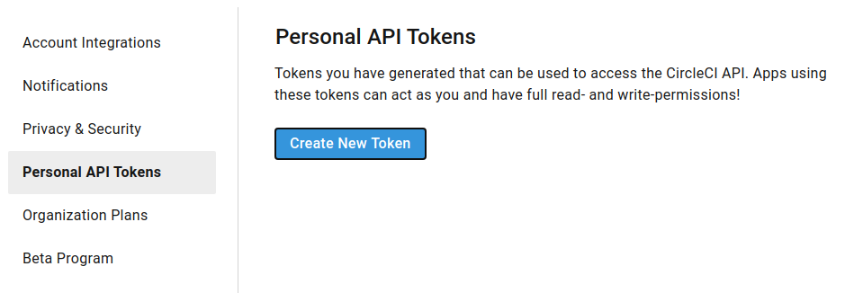
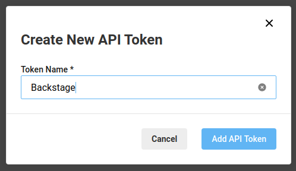

## Introduction

In order to make requests to the CircleCI API, you must provide Roadie with an API key.

## Steps

1. Make sure you are logged in to Circleci as the user you want to use for Backstage. We recommend creating a Github bot account for this.

2. Go to https://app.circleci.com/settings/user/tokens and select Create New Token.

   

3. Give the token a name and click Add API Token.

   

4. Circleci will print the token that Backstage needs.

5. Follow the instructions on how to share the API Token with Roadie.

## References

- [CircleCI docs for creating API tokens](https://circleci.com/docs/api/#add-an-api-token)
