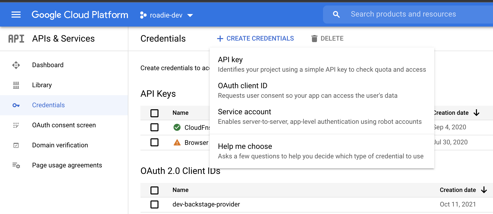
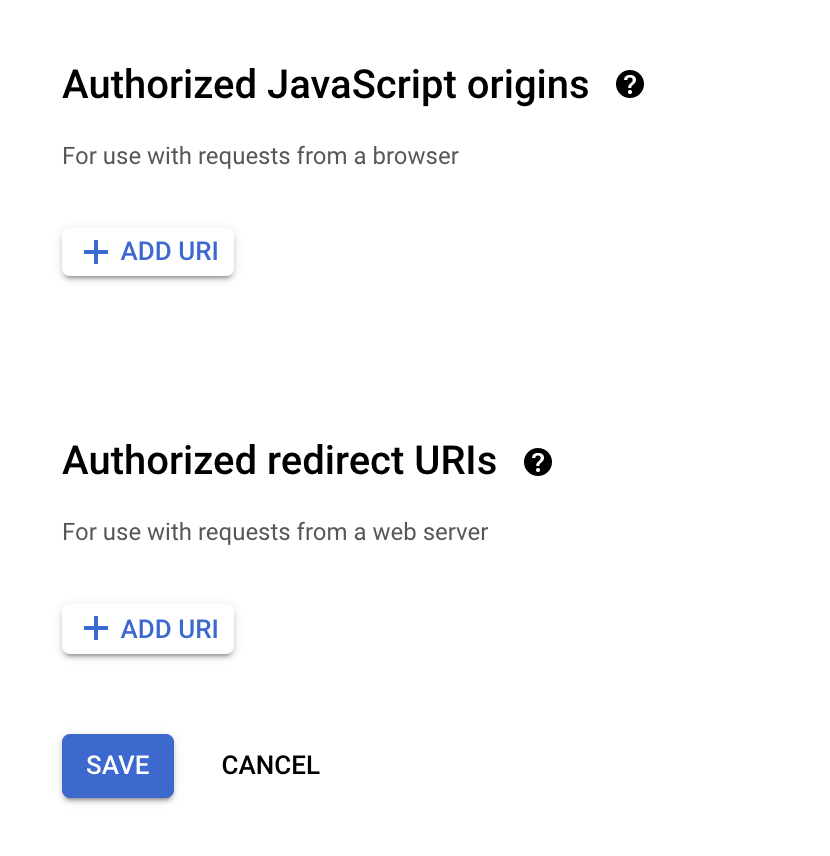
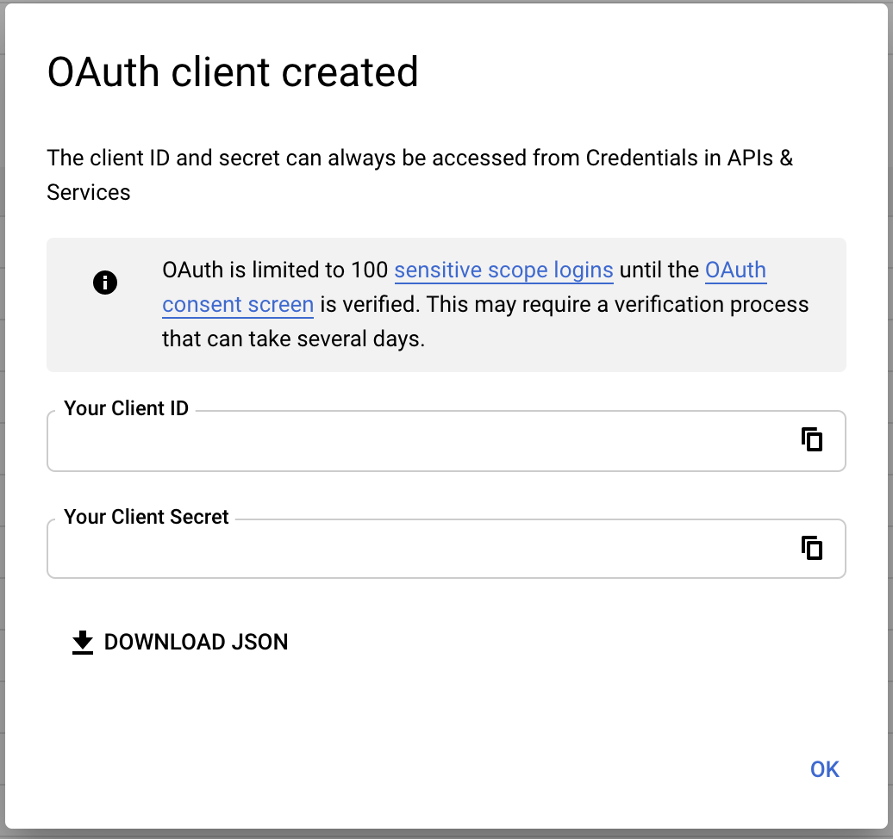

## Introduction

This Google OAuth client, will allow Backstage to authenticate your user, using your own controlled Google client

This page describes how to set up the client, along with setting the required values in Backstage.

> Note: This assumes you have access to your google cloud console 

## Steps

### Step 1: Creating an OAuth app

1. Sign into your GCP [console](https://console.cloud.google.com/apis/credentials)

2. Select the `APIs & Services` -> `Credentials`. Now click on the `Create Credentials` button, followed by `OAuth client ID`

3. From the dropdown menu select `Web application`, then name it something like 'Roadie OAuth client'.

4. Click on the `Add URI` button under the `Authorized JavaScript origins` and enter the name of your roadie backstage instance (eg. https://<yourcompany>.roadie.so))

5. Click on the `Add URI` button under the `Authorized redirect URIs` and enter the name of your roadie backstage instance followed by the following path: `/api/auth/google/handler/frame` (eg. https://<yourcompany>.roadie.so/api/auth/google/handler/frame)

6. Save + store client secret and ID for later

### Step 2: Adding secrets to backstage

1. Navigate to ”https://<tenant-name>.roadie.so/administration/settings/secrets”

2. Using the Secret from step 1, click the pencil marker for the following field `GOOGLE_CLIENT_SECRET` and save.

3. Using the client id from step 1, click the pencil marker for the following field `GOOGLE_CLIENT_ID` and save.

## Conclusion

After adding the the OAuth client to your Backstage instance, you will be able to authenticate against Google so that you can read resources on your cloud platform.