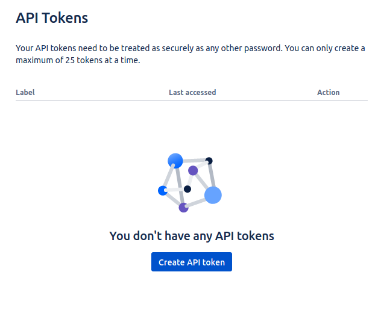
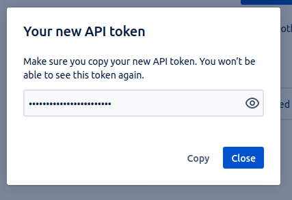

## Introduction

In order to use the Jira plugin, Roadie needs an API token to communicate with Jira APIs.


These are set within backstage at the following url:

```text
https://<tenant-name>.roadie.so/administration/settings/secrets
```

This page describes how to create and set up the API token.

## Steps

### Step 1: Create an API token

Start by visiting the user profile settings page for your Jira user: https://id.atlassian.com/manage-profile/security/api-tokens. Note that it is a good practice to create an automation/bot account to Jira for API usage 

Click on the "Create API token" button.

   

On the modal window you can give the token a label, so you can recognize it later, e.g. "Roadie Backstage" and finally Atlassian will show you the API token once. Make note of this token, you will only be able to see it once.

   

### Step 2: Base64 encode the credentials 

The Jira plugin handles authentication using Basic auth so the token needs to be converted into a compatible format. First we need to prefix the token with the Jira user email and base64 encode it. For example `jira-mail@example.com:hTBgqVcrcxRYpT5TCzTA9C0F` converts to `amlyYS1tYWlsQGV4YW1wbGUuY29tOmhUQmdxVmNyY3hSWXBUNVRDelRBOUMwRg==`

### Step 3: Store the credentials and Jira URL in Roadie
Visit `https://<tenant-name>.roadie.so/administration/settings/secrets` and enter the base64 encoded and prefixed token value from above into `JIRA_API_TOKEN`.

Additionally add the URL to your Jira instance into `JIRA_API_URL`. The URL should not contain a trailing slash, e.g. `https://roadie.atlassian.net`.

## References

- [Atlassian docs for creating API tokens](https://support.atlassian.com/atlassian-account/docs/manage-api-tokens-for-your-atlassian-account/)
