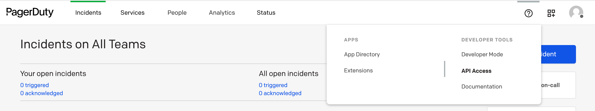
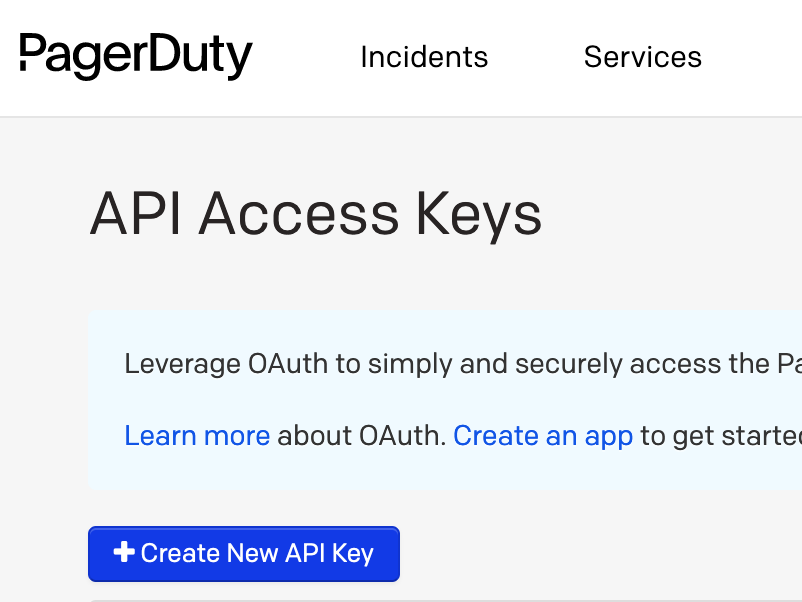
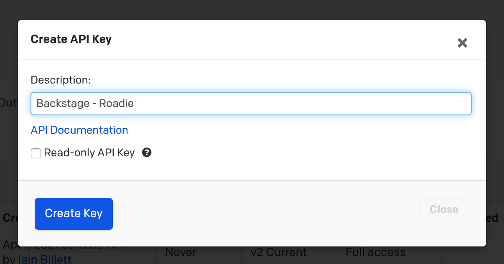

## Introduction

In order to use the PagerDuty plugin, Roadie needs an API token to communicate with it's APIs.


These are set within backstage at the following url:

```text
https://<tenant-name>.roadie.so/administration/settings/secrets
```

This page describes how to create and set up the API token.

## Steps

### Step 1: Create an API token

Start by logging into PagerDuty `https://app.pagerduty.com`. Note that it is a good practice to create an automation/bot account for API usage

Expand the menu item in the top right of top menu bar and click on the "API Access" menu item.

   

On the API Access page, click the "Create New API Key" button.

   

Set a sensible description and click "Create Key"

   

You will see the API key you have created in a modal window.

### Step 3: Store the credentials and PagerDuty URL in Roadie

Visit `https://<tenant-name>.roadie.so/administration/settings/secrets` and enter the API Key value from above into `PAGERDUTY_TOKEN`.


**Note:** We just need you configure the token as it is from PagerDuty. If you are familiar with the way to configure PagerDuty in backstage on prem or locally you maybe using a more complicated format.

## References

- [PagerDuty docs for creating API tokens](https://support.pagerduty.com/docs/generating-api-keys)
