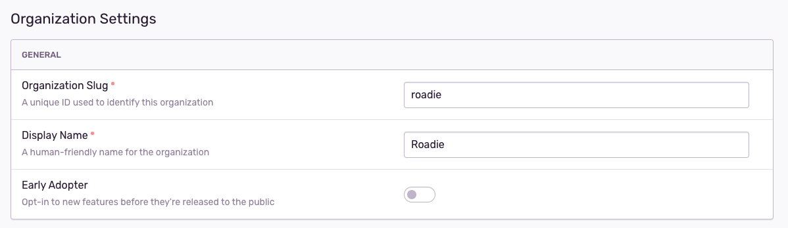
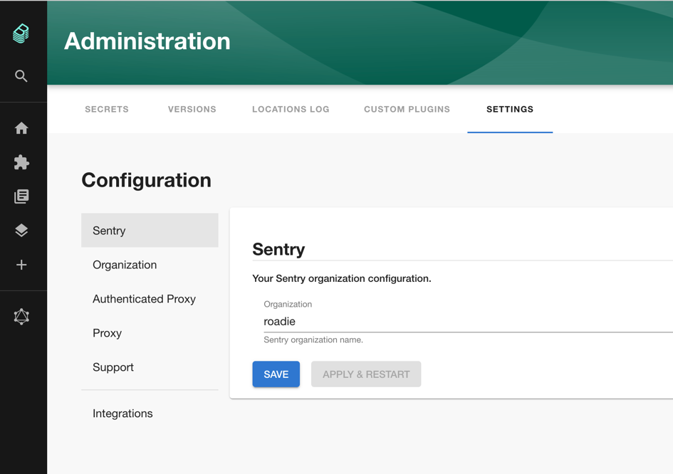
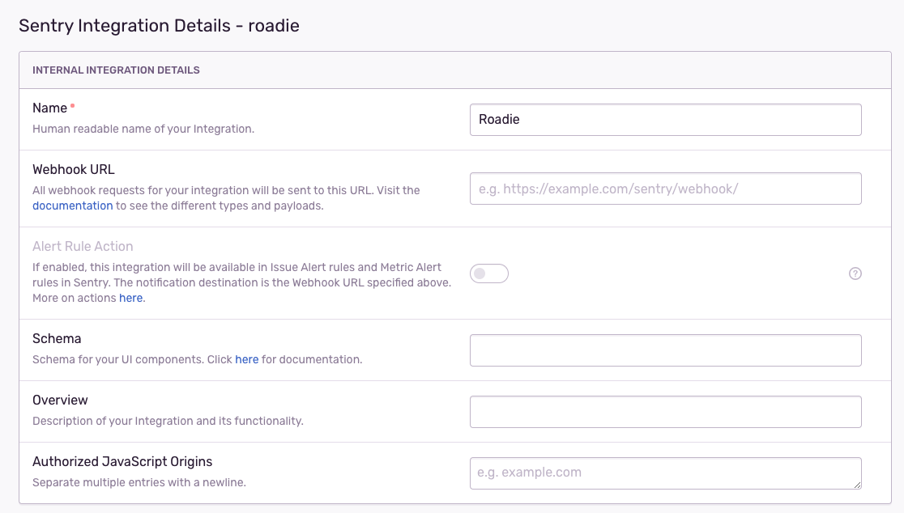
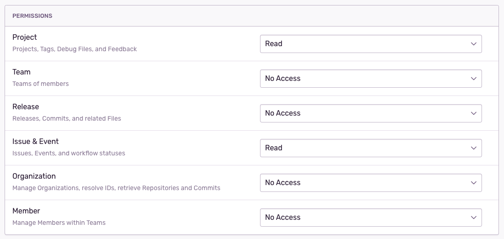
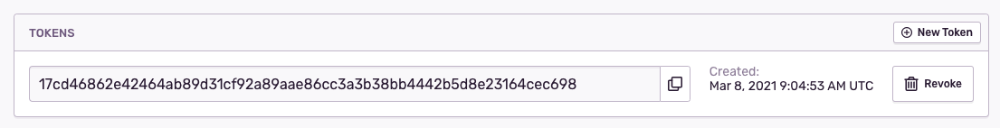
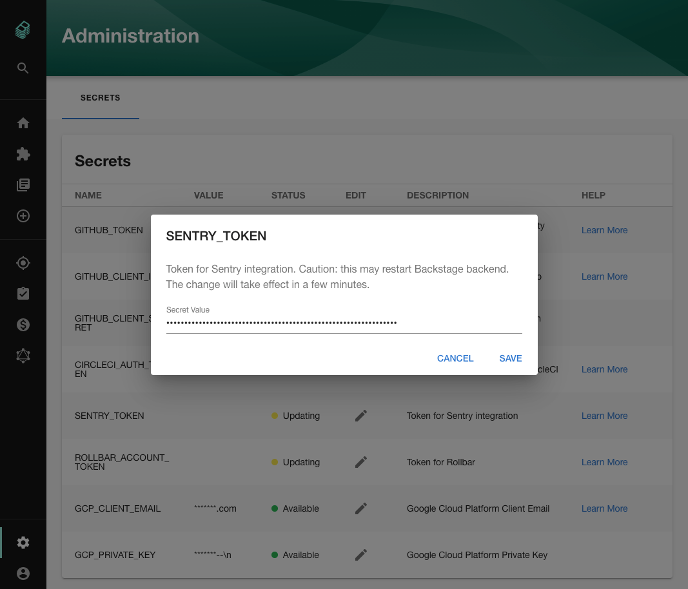
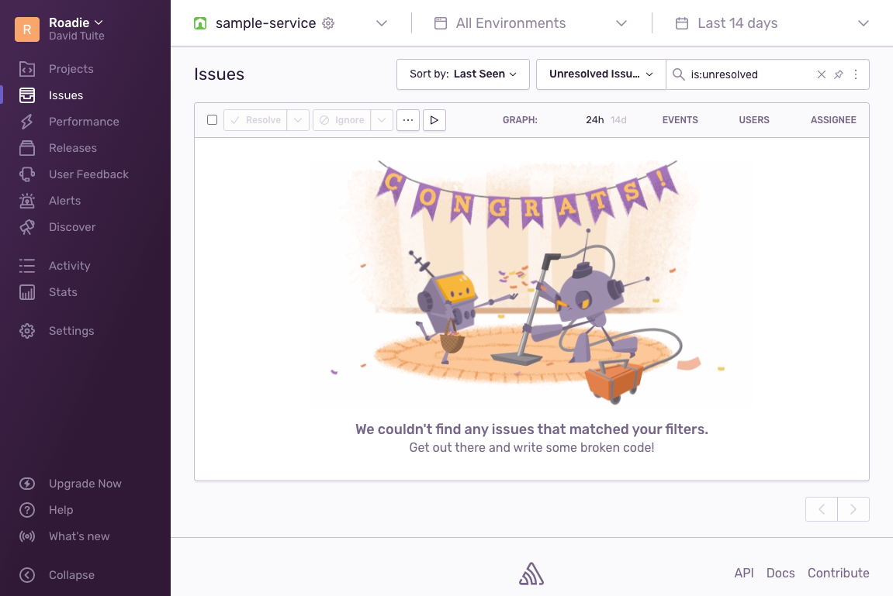
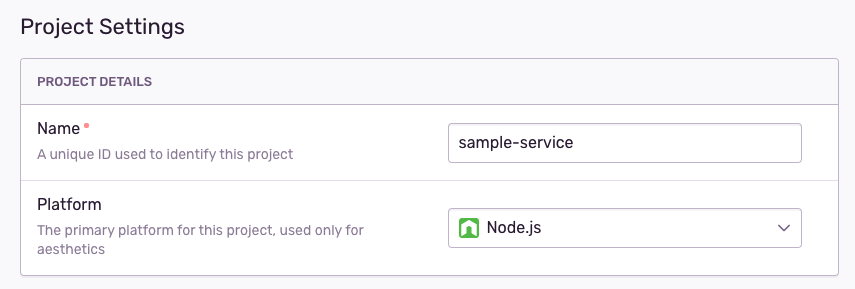

## Introduction

In order to use the Backstage Sentry plugin with Roadie, you must securely provide Roadie with an API key which it can use to access the Sentry API.

## Connect Roadie to Sentry

### Step 1: Set your Sentry organization

Click the dropdown in the top left corner of the Sentry UI and click "Organization settings".

Copy the value of the Organization Slug from the settings. The value shown here is `roadie`. You will have a different value.



Go to the Administration Settings page and set the Sentry organization name.



### Step 2: Get a Sentry token

Create an Internal Integration using the Sentry UI. Click "Settings" in the left sidebar, then "Developer Settings". Next click the "New Internal Integration" button.

Give the integration a name like "Roadie".



Give the integration the ability to read projects and issues.



Click the "Save Changes" button.

Copy the token that Sentry displays.



### Step 3: Add the token to Roadie

Visit `https://your-company.roadie.so/administration/settings/secrets`.

Click the pencil icon beside `SENTRY_TOKEN`. Enter the token you copied from the Sentry UI into the input in the dialog that pops up.



Click Save.

Wait a few moments for the secret to be applied.

### Step 4: Add the Sentry annotation to a component

Using the Sentry UI, find a Sentry project which you would like to associate with a component in Roadie.

Click the gear icon beside your project name to view the project settings.



Copy the name from the Project settings



Edit the `catalog-info.yaml` for the component you wish to associate with this Sentry project and add the `sentry.io/project-slug` annotation.

```yaml
apiVersion: backstage.io/v1alpha1
kind: Component
metadata:
  name: sample-service
  description: Sample service
  annotations:
    sentry.io/project-slug: sample-service
```

Commit and push this change and Roadie should pick it up within a few minutes.

## References

1. [Sentry integration docs](https://docs.sentry.io/product/integrations/integration-platform/)
