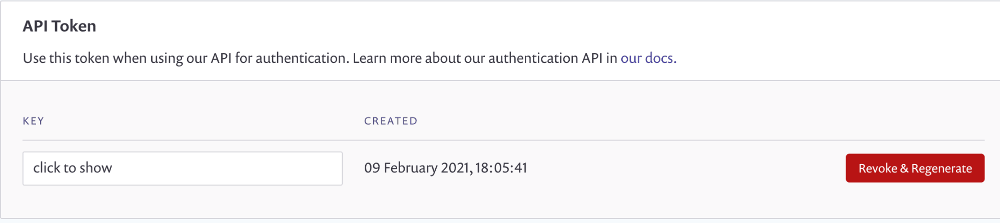
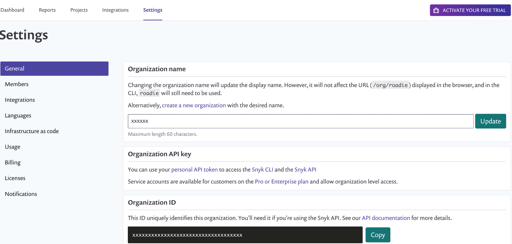
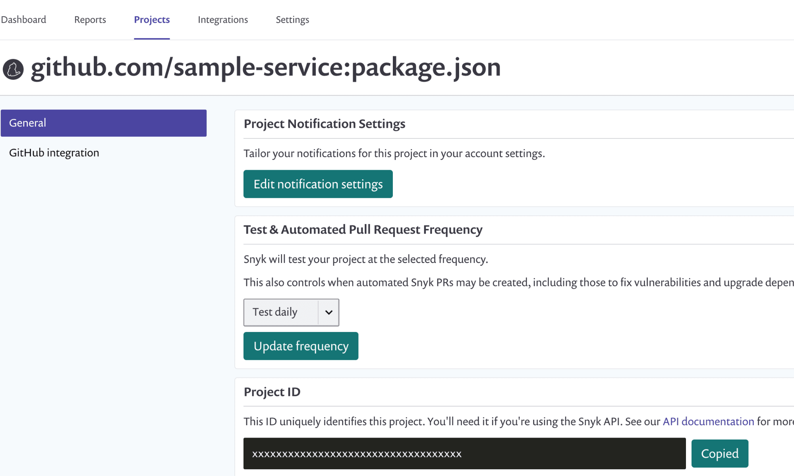
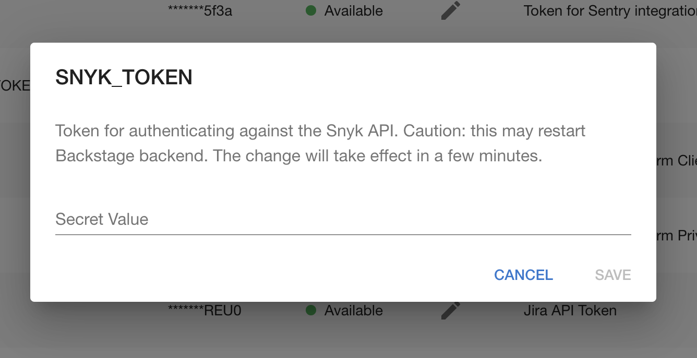

## Introduction

In order to use the Backstage Snyk plugin with Roadie, you must securely provide Roadie with an API token which it can use to access the Snyk API.

## Connect Roadie to Snyk

To get an API token, you need to sign up for a Snyk account. Within this account, you will need to obtain three things:

 * API token
 * Organization Name
 * Project ID

#### API Token

This can be found by clicking your name in the top right-hand corner and going to General Settings.



#### Organization Name

This can be found under the settings page that is visible when you login to Snyk.



#### Project Id

This can be found under the Projects tab. It will be used to link snyk projects to backstage.




### Step 1: Add the token to Roadie

Visit `https://your-company.roadie.so/administration/settings/secrets`.

Click the pencil icon beside `SNYK_TOKEN`. Enter it into the input in the dialog that pops up (See above for retrieving token).



Click Save.

Wait a few moments for the secret to be applied.

### Step 2: Add the Snyk annotation to a component

Using the Snyk UI, find a Snyk project which you would like to associate with a component in Roadie (see above for retrieving ID.

Copy the name from the Project settings

Edit the `catalog-info.yaml` for the component you wish to associate with this Snyk project and add the `snyk.io/org-name` and `snyk.io/project-ids` annotation.

```yaml
apiVersion: backstage.io/v1alpha1
kind: Component
metadata:
  name: sample-service
  description: Sample service
  annotations:
    snyk.io/org-name: <Your organization>
    snyk.io/project-ids: <Your Project ID>
```

Commit and push this change and Roadie should pick it up within a few minutes.

## References

1. [Snyk integration docs](https://snyk.io/blog/backstage-integration-with-the-snyk-api/)
