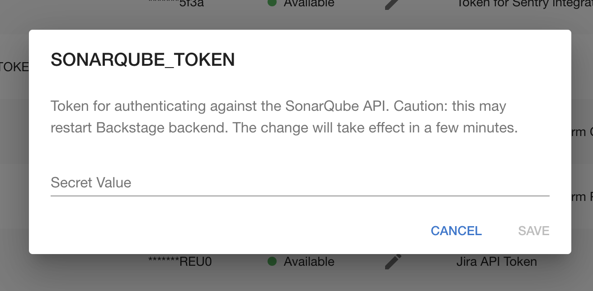
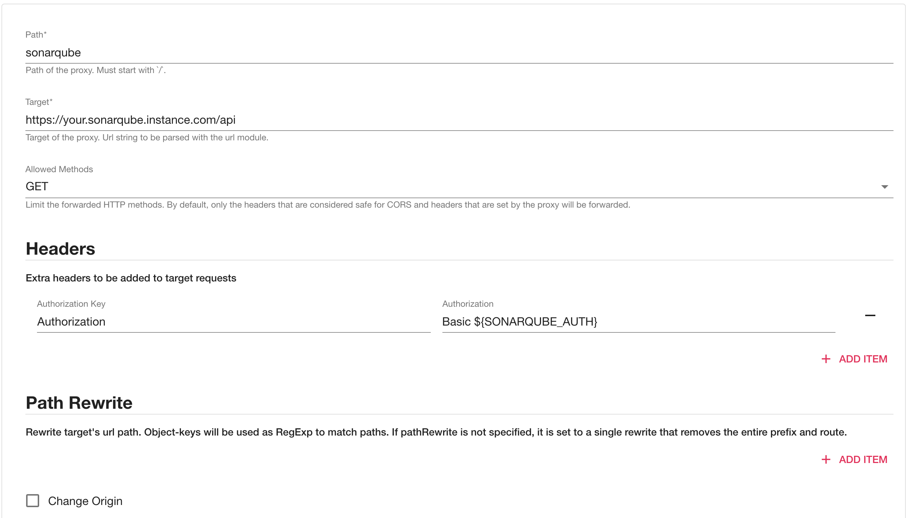

## Introduction

In order to use the SonarQube plugin, Roadie needs an API token to communicate with SonarQube's APIs.


These are set within backstage at the following url:

```text
https://<tenant-name>.roadie.so/administration/settings/secrets
```

This page describes how to create and set up the API token.

## Steps

### Step 1: Create an API token

In order for the Backstage integration to work we must first generate our api key. These can be found from:
 * [Sonarcloud](https://sonarcloud.io/account/security) for your sonarcloud plugin
 * [SonarQube](https://docs.sonarqube.org/latest/user-guide/user-token/) for your sonarqube plugin

### Step 2: Store the credentials and SonarQube URL in Roadie
Visit `https://<tenant-name>.roadie.so/administration/settings/secrets` and enter the token value from above into `SONARQUBE_TOKEN`.



### Optional Step 3: Set SonarQube proxy in the settings

This step is only required when integrating with an on-prem SonarCube instance.

Visit `https://<tenant-name>.roadie.so/administration/settings/proxy` and create a new proxy.

``` yaml
proxy:
  '/sonarqube':
    target: https://your.sonarqube.instance.com/api
    allowedMethods: ['GET']
    auth: "${SONARQUBE_TOKEN}:"

```


## References

- [SonarQube backstage plugin](https://www.npmjs.com/package/@backstage/plugin-sonarqube/)
