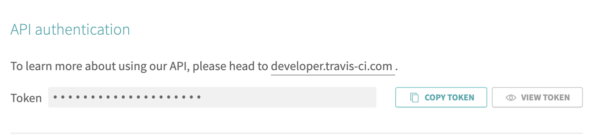
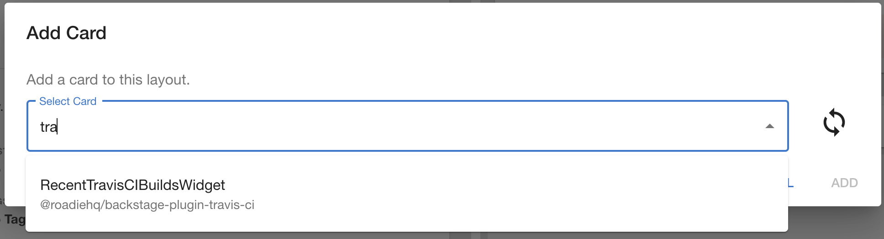
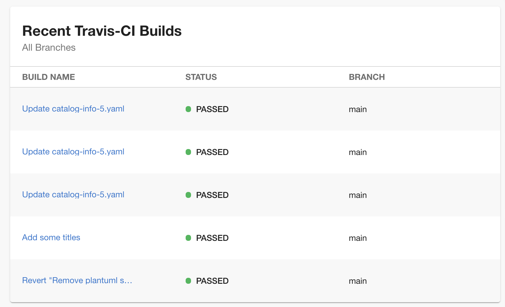
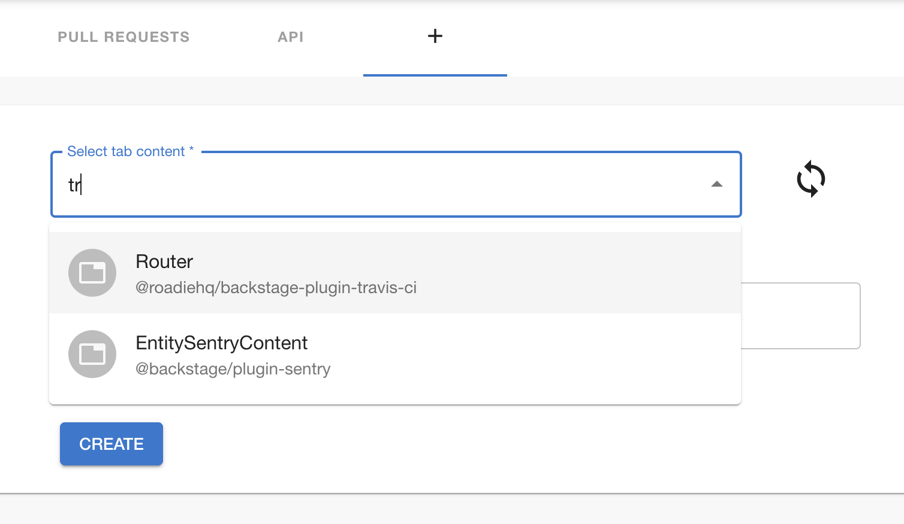
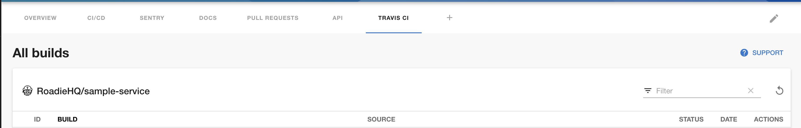

## Introduction

In order to use the Travis CI plugin, Roadie needs an API token to communicate with Travis CI APIs.

This is set within backstage at the following url:

```text
https://<tenant-name>.roadie.so/administration/settings/secrets
```

This page describes how to create and set up the Travis CI API.

## Steps

### Step 1: Create an API token

Start by visiting the account settings page in [Travis](https://www.travis-ci.com/account/preferences).

Click on the "Copy token" button under the API settings section.

   


### Step 2: Store the token in Roadie
Visit:

```text
https://<tenant-name>.roadie.so/administration/settings/secrets
```

Enter the token value from above into `TRAVISCI_AUTH_TOKEN`.

### Step 3: Adding annotations to your catalog.yaml

Add annotation to the yaml config file of a component.
Where `<owner-name>` is the owner of the project in travis and `<project-name>` is the name of the project in travis.

```text
travis-ci.com/repo-slug: owner-name/project-name
```

### Step 4: Adding travis card

Navigate to the catalog entity you want to add the travis card to.

Click on the edit gear on the top right of the page



You should now see something like this:




### Step 4: Adding travis tab

Navigate to the catalog entity you want to add the travis tab to.

Click on the `+` icon on the tabs bar (top right of the page)



You should now see something like this:




## References

- [Token, Token, Token](https://blog.travis-ci.com/2013-01-28-token-token-token)
